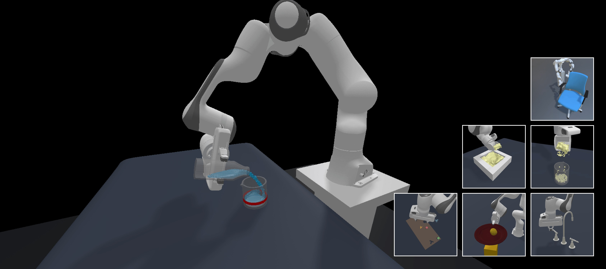

# ManiSkill 3 (Beta)



<p style="text-align: center; font-size: 0.8rem; color: #999;margin-top: -1rem;">Sample of environments/robots rendered with ray-tracing. Scene datasets sourced from AI2THOR and ReplicaCAD</p>

[](https://pepy.tech/project/mani_skill)
[](https://colab.research.google.com/github/haosulab/ManiSkill/blob/main/examples/tutorials/1_quickstart.ipynb)
[](https://badge.fury.io/py/mani-skill)
[](https://maniskill.readthedocs.io/en/latest/)
[](https://discord.gg/x8yUZe5AdN)

ManiSkill is a powerful unified framework for robot simulation and training powered by [SAPIEN](https://sapien.ucsd.edu/), with a strong focus on manipulation skills. The entire tech stack is as open-source as possible and ManiSkill v3 is in beta release now. Among its features include:
- GPU parallelized visual data collection system. On the high end you can collect RGBD + Segmentation data at 30,000+ FPS with a 4090 GPU!
- GPU parallelized simulation, enabling high throughput state-based synthetic data collection in simulation
- GPU parallelized heterogeneous simulation, where every parallel environment has a completely different scene/set of objects
- Example tasks cover a wide range of different robot embodiments (humanoids, mobile manipulators, single-arm robots) as well as a wide range of different tasks (table-top, drawing/cleaning, dextrous manipulation)
- Flexible and simple task building API that abstracts away much of the complex GPU memory management code via an object oriented design
- Real2sim environments for scalably evaluating real-world policies 100x faster via GPU simulation.
- Sim2real support for deploying policies trained in simulation to the real world
- Many tuned robot learning baselines in Reinforcement Learning (e.g. PPO, SAC, [TD-MPC2](https://github.com/nicklashansen/tdmpc2)), Imitation Learning (e.g. Behavior Cloning, [Diffusion Policy](https://github.com/real-stanford/diffusion_policy)), and large Vision Language Action (VLA) models (e.g. [Octo](https://github.com/octo-models/octo), [RDT-1B](https://github.com/thu-ml/RoboticsDiffusionTransformer), [RT-x](https://robotics-transformer-x.github.io/))

For more details we encourage you to take a look at our [paper](https://arxiv.org/abs/2410.00425), published at [RSS 2025](https://roboticsconference.org/).

Please refer to our [documentation](https://maniskill.readthedocs.io/en/latest/user_guide) to learn more information from tutorials on building tasks to sim2real to running baselines.

**NOTE:**
This project currently is in a **beta release**, so not all features have been added in yet and there may be some bugs. If you find any bugs or have any feature requests please post them to our [GitHub issues](https://github.com/haosulab/ManiSkill/issues/) or discuss about them on [GitHub discussions](https://github.com/haosulab/ManiSkill/discussions/). We also have a [Discord Server](https://discord.gg/x8yUZe5AdN) through which we make announcements and discuss about ManiSkill.

Users looking for the original ManiSkill2 can find the commit for that codebase at the [v0.5.3 tag](https://github.com/haosulab/ManiSkill/tree/v0.5.3)


## Installation
Installation of ManiSkill is extremely simple, you only need to run a few pip installs and setup Vulkan for rendering.

```bash
# install the package
pip install --upgrade mani_skill
# install a version of torch that is compatible with your system
pip install torch
```

Finally you also need to set up Vulkan with [instructions here](https://maniskill.readthedocs.io/en/latest/user_guide/getting_started/installation.html#vulkan)

For more details about installation (e.g. from source, or doing troubleshooting) see [the documentation](https://maniskill.readthedocs.io/en/latest/user_guide/getting_started/installation.html
)

## Getting Started

To get started, check out the quick start documentation: https://maniskill.readthedocs.io/en/latest/user_guide/getting_started/quickstart.html

We also have a quick start [colab notebook](https://colab.research.google.com/github/haosulab/ManiSkill/blob/main/examples/tutorials/1_quickstart.ipynb) that lets you try out GPU parallelized simulation without needing your own hardware. Everything is runnable on Colab free tier.

For a full list of example scripts you can run, see [the docs](https://maniskill.readthedocs.io/en/latest/user_guide/demos/index.html).

## System Support

We currently best support Linux based systems. There is limited support for windows and MacOS at the moment. We are working on trying to support more features on other systems but this may take some time. Most constraints stem from what the [SAPIEN](https://github.com/haosulab/SAPIEN/) package is capable of supporting.

| System / GPU         | CPU Sim | GPU Sim | Rendering |
| -------------------- | ------- | ------- | --------- |
| Linux / NVIDIA GPU   | ✅      | ✅      | ✅        |
| Windows / NVIDIA GPU | ✅      | ❌      | ✅        |
| Windows / AMD GPU    | ✅      | ❌      | ✅        |
| WSL / Anything       | ✅      | ❌      | ❌        |
| MacOS / Anything     | ✅      | ❌      | ✅        |

## Citation


If you use ManiSkill3 (versions `mani_skill>=3.0.0`) in your work please cite our [ManiSkill3 paper](https://arxiv.org/abs/2410.00425) as so:

```
@article{taomaniskill3,
  title={ManiSkill3: GPU Parallelized Robotics Simulation and Rendering for Generalizable Embodied AI},
  author={Stone Tao and Fanbo Xiang and Arth Shukla and Yuzhe Qin and Xander Hinrichsen and Xiaodi Yuan and Chen Bao and Xinsong Lin and Yulin Liu and Tse-kai Chan and Yuan Gao and Xuanlin Li and Tongzhou Mu and Nan Xiao and Arnav Gurha and Viswesh Nagaswamy Rajesh and Yong Woo Choi and Yen-Ru Chen and Zhiao Huang and Roberto Calandra and Rui Chen and Shan Luo and Hao Su},
  journal = {Robotics: Science and Systems},
  year={2025},
} 
```

If you use ManiSkill2 (version `mani_skill==0.5.3` or lower) in your work please cite the ManiSkill2 paper as so:
```
@inproceedings{gu2023maniskill2,
  title={ManiSkill2: A Unified Benchmark for Generalizable Manipulation Skills},
  author={Gu, Jiayuan and Xiang, Fanbo and Li, Xuanlin and Ling, Zhan and Liu, Xiqiang and Mu, Tongzhou and Tang, Yihe and Tao, Stone and Wei, Xinyue and Yao, Yunchao and Yuan, Xiaodi and Xie, Pengwei and Huang, Zhiao and Chen, Rui and Su, Hao},
  booktitle={International Conference on Learning Representations},
  year={2023}
}
```

Note that some other assets, algorithms, etc. in ManiSkill are from other sources/research. We try our best to include the correct citation bibtex where possible when introducing the different components provided by ManiSkill.

## License

All rigid body environments in ManiSkill are licensed under fully permissive licenses (e.g., Apache-2.0).

The assets are licensed under [CC BY-NC 4.0](https://creativecommons.org/licenses/by-nc/4.0/legalcode).
