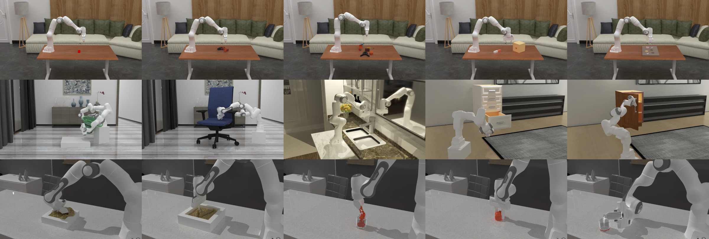

# ManiSkill2



[](https://badge.fury.io/py/mani-skill2)
[](https://colab.research.google.com/github/haosulab/ManiSkill2/blob/main/examples/tutorials/1_quickstart.ipynb)
[](https://haosulab.github.io/ManiSkill2)
[](https://discord.gg/x8yUZe5AdN)
<!-- [](https://haosulab.github.io/ManiSkill2) -->

ManiSkill2 is a unified benchmark for learning generalizable robotic manipulation skills powered by [SAPIEN](https://sapien.ucsd.edu/). **It features 20 out-of-box task families with 2000+ diverse object models and 4M+ demonstration frames**. Moreover, it empowers fast visual input learning algorithms so that **a CNN-based policy can collect samples at about 2000 FPS with 1 GPU and 16 processes on a workstation**. The benchmark can be used to study a wide range of algorithms: 2D & 3D vision-based reinforcement learning, imitation learning, sense-plan-act, etc.

Please refer to our [documentation](https://haosulab.github.io/ManiSkill2) to learn more information. There are also hands-on [tutorials](examples/tutorials) (e.g, [quickstart colab tutorial](https://colab.research.google.com/github/haosulab/ManiSkill2/blob/main/examples/tutorials/1_quickstart.ipynb)).

<!-- We invite you to participate in the associated [ManiSkill2 challenge](https://sapien.ucsd.edu/challenges/maniskill/) where the top teams will be awarded prizes. -->

**Table of Contents**

- [Installation](#installation)
- [Getting Started](#getting-started)
- [Reinforcement Learning Example with ManiSkill2-Learn](#reinforcement-learning-example-with-maniskill2-learn)
- [Demonstrations](#demonstrations)
<!-- - [ManiSkill2 Challenge](#maniskill2-challenge) -->
- [Leaderboard](#leaderboard)
- [License](#license)
- [Citation](#citation)

## Installation

From pip:

```bash
pip install mani-skill2
```

From github:

```bash
pip install --upgrade git+https://github.com/haosulab/ManiSkill2.git
```

From source:

```bash
git clone https://github.com/haosulab/ManiSkill2.git
cd ManiSkill2 && pip install -e .
```

---

A GPU with the Vulkan driver installed is required to enable rendering in ManiSkill2. The rigid-body environments, powered by SAPIEN, are ready to use after installation. Test your installation:

```bash
# Run an episode (at most 200 steps) of "PickCube-v0" (a rigid-body environment) with random actions
# Or specify an environment by "-e ${ENV_ID}"
python -m mani_skill2.examples.demo_random_action
```

Some environments require **downloading assets**. You can download all the assets by `python -m mani_skill2.utils.download_asset all` or download task-specific assets by `python -m mani_skill2.utils.download_asset ${ENV_ID}`. The assets will be downloaded to `./data/` by default, and you can also use the environment variable `MS2_ASSET_DIR` to specify this destination.

Please refer to our [documentation](https://haosulab.github.io/ManiSkill2/concepts/environments.html) for details on all supported environments. The documentation also indicates which environments require downloading assets.

---

The soft-body environments are based on SAPIEN and customized [NVIDIA Warp](https://github.com/NVIDIA/warp), which requires **CUDA toolkit >= 11.3 and gcc** to compile. Please refer to the [documentation](https://haosulab.github.io/ManiSkill2/getting_started/installation.html#warp-maniskill2-version) for more details about installing ManiSkill2 Warp.

---

We further provide a docker image (`haosulab/mani-skill2`) on [Docker Hub](https://hub.docker.com/repository/docker/haosulab/mani-skill2/general) and its corresponding [Dockerfile](./docker/Dockerfile).

If you encounter any issues with installation, please see the [troubleshooting](https://haosulab.github.io/ManiSkill2/getting_started/installation.html#troubleshooting) section for common fixes or submit an [issue](https://github.com/haosulab/ManiSkill2/issues).

## Getting Started

Here is a basic example of how to make an [Gym/Gymnasium](https://github.com/farama-foundation/gymnasium) environment and run a random policy.

```python
import gymnasium as gym
import mani_skill2.envs

env = gym.make("PickCube-v0", obs_mode="rgbd", control_mode="pd_joint_delta_pos", render_mode="human")
print("Observation space", env.observation_space)
print("Action space", env.action_space)

obs, reset_info = env.reset(seed=0) # reset with a seed for randomness
terminated, truncated = False, False
while not terminated and not truncated:
    action = env.action_space.sample()
    obs, reward, terminated, truncated, info = env.step(action)
    env.render()  # a display is required to render
env.close()
```

Each `mani_skill2` environment supports different **observation modes** and **control modes**, which determine the **observation space** and **action space**. They can be specified by `gym.make(env_id, obs_mode=..., control_mode=...)`.

The basic observation modes supported are `pointcloud`, `rgbd`, `state_dict` and `state`.
Please refer to our documentation for information on the [observation](https://haosulab.github.io/ManiSkill2/concepts/observation.html) and [control](https://haosulab.github.io/ManiSkill2/concepts/controllers.html) modes available and their details.

Moreover, you can follow the [example](https://haosulab.github.io/ManiSkill2/getting_started/quickstart.html#interactive-play) to interactively play with our environments.

---

We provide hands-on tutorials about ManiSkill2. All the tutorials can be found [here](https://github.com/haosulab/ManiSkill2/blob/main/examples/tutorials).

- Getting Started: [Jupyter Notebook](./examples/tutorials/1_quickstart.ipynb), [Colab](https://colab.research.google.com/github/haosulab/ManiSkill2/blob/main/examples/tutorials/1_quickstart.ipynb)
- Reinforcement Learning: [Jupyter Notebook](./examples/tutorials/2_reinforcement_learning.ipynb), [Colab](https://colab.research.google.com/github/haosulab/ManiSkill2/blob/main/examples/tutorials/2_reinforcement_learning.ipynb)
- Imitation Learning: [Jupyter Notebook](./examples/tutorials/3_imitation_learning.ipynb), [Colab](https://colab.research.google.com/github/haosulab/ManiSkill2/blob/main/examples/tutorials/3_imitation_learning.ipynb)
- Environment Customization: [Jupyter Notebook](./examples/tutorials/customize_environments.ipynb), [Colab](https://colab.research.google.com/github/haosulab/ManiSkill2/blob/main/examples/tutorials/customize_environments.ipynb)
- Advanced Rendering (ray tracing, stereo depth sensor): [Jupyter Notebook](./examples/tutorials/advanced_rendering.ipynb)

See <https://sapien.ucsd.edu/docs/latest/> for the tutorials of SAPIEN (the backend of ManiSkill2).

## Reinforcement Learning Example with ManiSkill2-Learn

We provide [ManiSkill2-Learn](https://github.com/haosulab/ManiSkill2-Learn), an improved framework based on [ManiSkill-Learn](https://github.com/haosulab/ManiSkill-Learn) for training RL agents with demonstrations to solve manipulation tasks. The framework conveniently supports both point cloud-based and RGB-D-based policy learning, and the custom processing of these visual observations. It also supports many common algorithms (BC, PPO, DAPG, SAC, GAIL). Moreover, this framework is optimized for point cloud-based policy learning, and includes some helpful and empirical advice to get you started.

## Demonstrations

Please see our [documentation](https://haosulab.github.io/ManiSkill2/concepts/demonstrations.html) for more details.

<!-- ## ManiSkill2 Challenge

The ManiSkill2 challenge is an ongoing competition using the ManiSkill2 benchmark. See our [website](https://sapien.ucsd.edu/challenges/maniskill/) for additional competition details and follow the [getting started](https://sapien.ucsd.edu/challenges/maniskill#getting-started) section to learn how to compete.

To create a submission for the competition, follow [the instructions on our wiki](https://github.com/haosulab/ManiSkill2/wiki/Participation-Guidelines) on how to create a submission and submit it to the leaderboard.

Previous results of the ManiSkill 2021 challenge can be found [here](https://sapien.ucsd.edu/challenges/maniskill#maniskill2021). Winning solutions and their codes can be found in the previous challenge.

## Leaderboard

You can find the leaderboard on the challenge website: <https://sapien.ucsd.edu/challenges/maniskill/challenges/ms2>. -->

## License

All rigid body environments in ManiSkill are licensed under fully permissive licenses (e.g., Apache-2.0).

However, the soft body environments will follow Warp's license. Currently, they are licensed under
[NVIDIA Source Code License for Warp](https://github.com/NVIDIA/warp/blob/main/LICENSE.md).

The assets are licensed under [CC BY-NC 4.0](https://creativecommons.org/licenses/by-nc/4.0/legalcode).

## Citation

If you use ManiSkill2 or its assets and models, consider citing the following publication:

```
@inproceedings{gu2023maniskill2,
  title={ManiSkill2: A Unified Benchmark for Generalizable Manipulation Skills},
  author={Gu, Jiayuan and Xiang, Fanbo and Li, Xuanlin and Ling, Zhan and Liu, Xiqiaing and Mu, Tongzhou and Tang, Yihe and Tao, Stone and Wei, Xinyue and Yao, Yunchao and Yuan, Xiaodi and Xie, Pengwei and Huang, Zhiao and Chen, Rui and Su, Hao},
  booktitle={International Conference on Learning Representations},
  year={2023}
}
```
