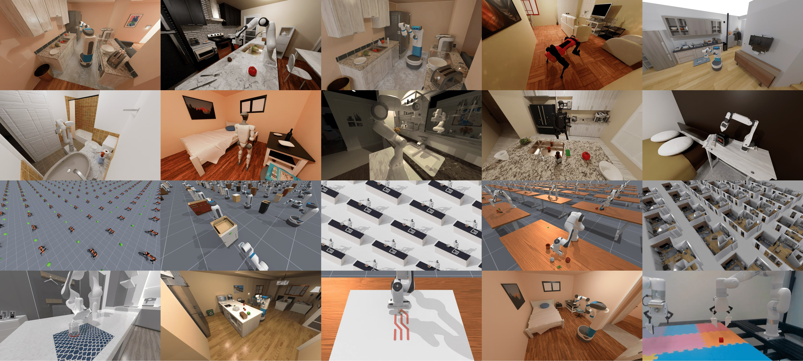

# ManiSkill


<p style="text-align: center; font-size: 0.8rem; color: #999;margin-top: -1rem;">Sample of environments/robots rendered with ray-tracing. Scene datasets sourced from AI2THOR and ReplicaCAD</p>

[](https://pepy.tech/project/mani_skill)
[](https://colab.research.google.com/github/haosulab/ManiSkill/blob/main/examples/tutorials/1_quickstart.ipynb)
[](https://badge.fury.io/py/mani-skill)
[](https://maniskill.readthedocs.io/en/latest/)
[](https://discord.gg/x8yUZe5AdN)

ManiSkill is a powerful unified framework for robot simulation and training powered by [SAPIEN](https://sapien.ucsd.edu/), with a strong focus on manipulation skills. The entire tech stack is as open-source as possible and ManiSkill v3 is in beta release now. Among its features include:
- GPU parallelized visual data collection system. On the high end you can collect RGBD + Segmentation data at 30,000+ FPS with a 4090 GPU!
- GPU parallelized simulation, enabling high throughput state-based synthetic data collection in simulation
- GPU parallelized heterogeneous simulation, where every parallel environment has a completely different scene/set of objects
- Example tasks cover a wide range of different robot embodiments (humanoids, mobile manipulators, single-arm robots) as well as a wide range of different tasks (table-top, drawing/cleaning, dextrous manipulation)
- Flexible and simple task building API that abstracts away much of the complex GPU memory management code via an object oriented design
- Real2sim environments for scalably evaluating real-world policies 100x faster via GPU simulation.
- Many tuned robot learning baselines in Reinforcement Learning (e.g. PPO, SAC, [TD-MPC2](https://github.com/nicklashansen/tdmpc2)), Imitation Learning (e.g. Behavior Cloning, [Diffusion Policy](https://github.com/real-stanford/diffusion_policy)), and large Vision Language Action (VLA) models (e.g. [Octo](https://github.com/octo-models/octo), [RDT-1B](https://github.com/thu-ml/RoboticsDiffusionTransformer), [RT-x](https://robotics-transformer-x.github.io/))

For more details we encourage you to take a look at our [paper](https://arxiv.org/abs/2410.00425), published at [RSS 2025](https://roboticsconference.org/).

There are more features to be added to ManiSkill 3, see [our roadmap](https://maniskill.readthedocs.io/en/latest/roadmap/index.html) for planned features that will be added over time before the official v3 is released.

Please refer to our [documentation](https://maniskill.readthedocs.io/en/latest/user_guide) to learn more information from tutorials on building tasks to data collection.

**NOTE:**
This project currently is in a **beta release**, so not all features have been added in yet and there may be some bugs. If you find any bugs or have any feature requests please post them to our [GitHub issues](https://github.com/haosulab/ManiSkill/issues/) or discuss about them on [GitHub discussions](https://github.com/haosulab/ManiSkill/discussions/). We also have a [Discord Server](https://discord.gg/x8yUZe5AdN) through which we make announcements and discuss about ManiSkill.

Users looking for the original ManiSkill2 can find the commit for that codebase at the [v0.5.3 tag](https://github.com/haosulab/ManiSkill/tree/v0.5.3)

```{toctree}
:maxdepth: 1

user_guide/index
tasks/index
robots/index
contributing/index
roadmap/index
```