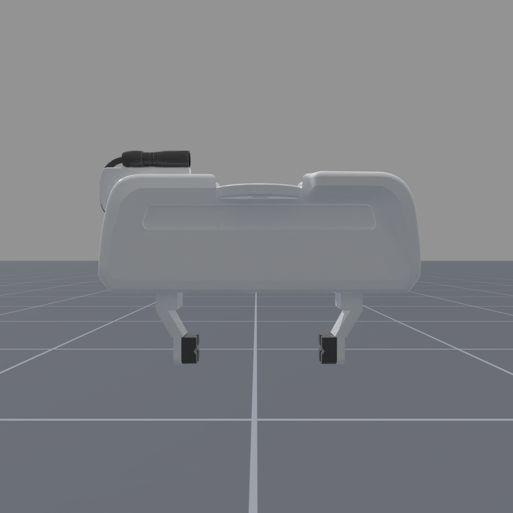
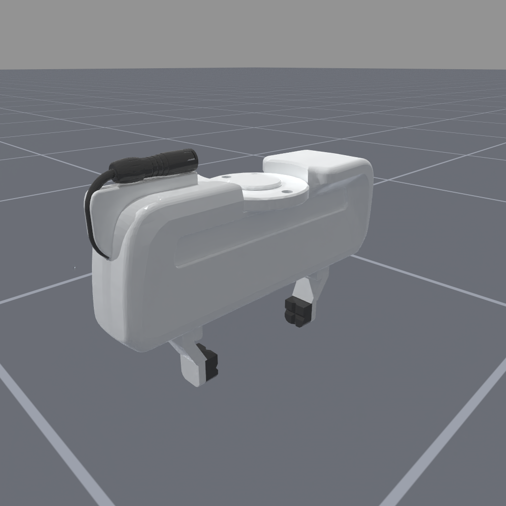
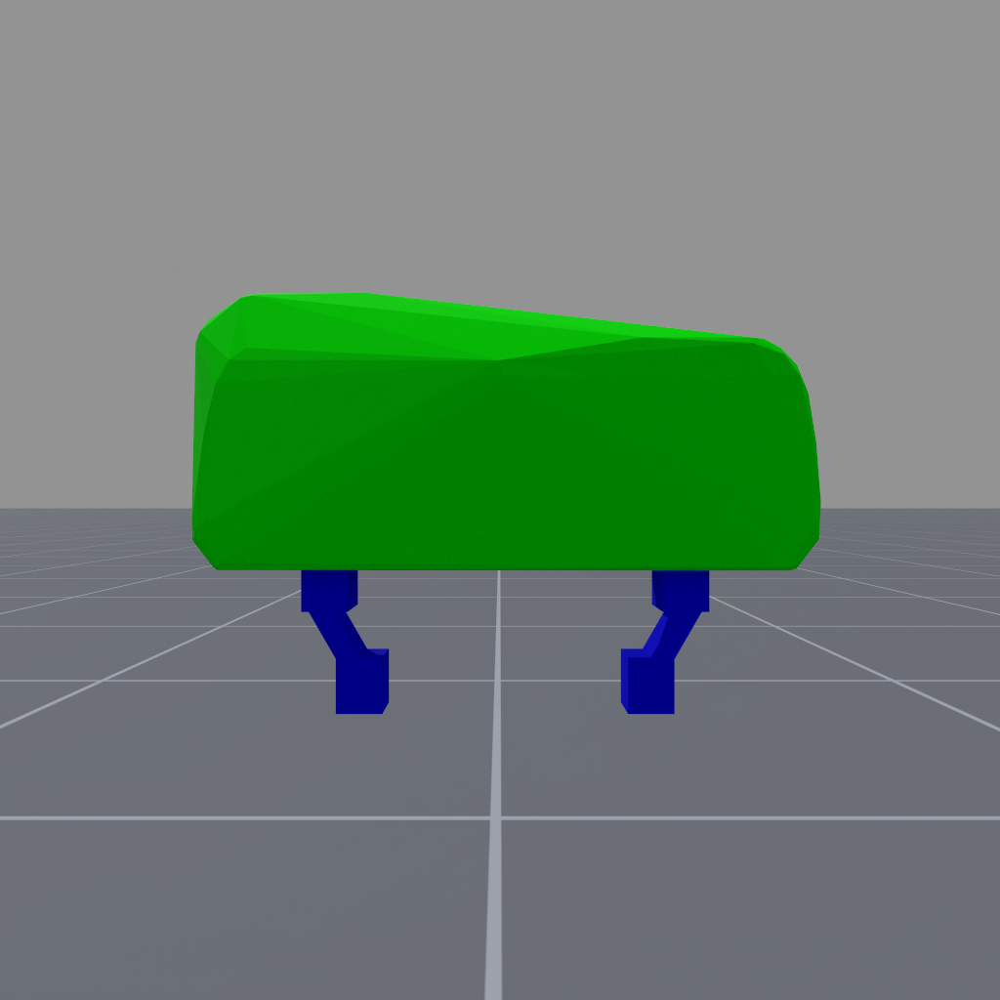
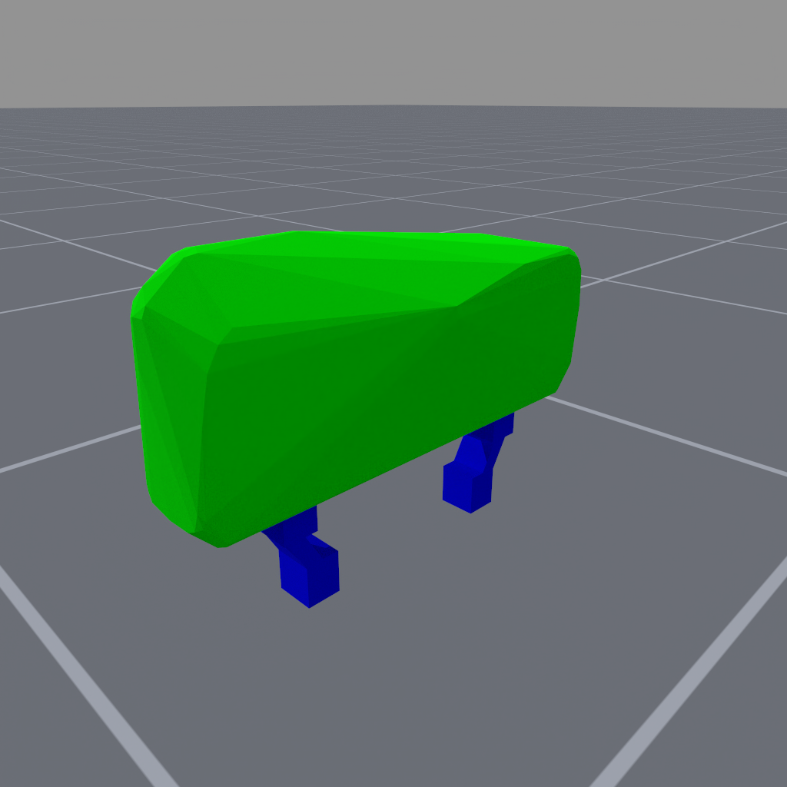

<!-- THIS IS ALL GENERATED DOCUMENTATION via generate_robot_docs.py. DO NOT MODIFY THIS FILE DIRECTLY. -->

# Floating Panda Gripper

Robot UID: `floating_panda_gripper`

Agent Class Code: [https://github.com/haosulab/ManiSkill/blob/main/mani_skill/agents/robots/floating_panda_gripper/floating_panda_gripper.py](https://github.com/haosulab/ManiSkill/blob/main/mani_skill/agents/robots/floating_panda_gripper/floating_panda_gripper.py)

Quality: B (Stable, but some values are unrealistic)

Degrees of Freedom: 8

Controllers: `pd_joint_delta_pos`, `pd_joint_pos`, `pd_ee_delta_pose`, `pd_ee_pose`, `pd_ee_pose_quat`

## Visuals and Collision Models

    

        
        
    

    
Visual Meshes

     
    

        
        
    

    
Collision Meshes (Green = Convex Mesh, Blue = Primitive Shape Mesh)

