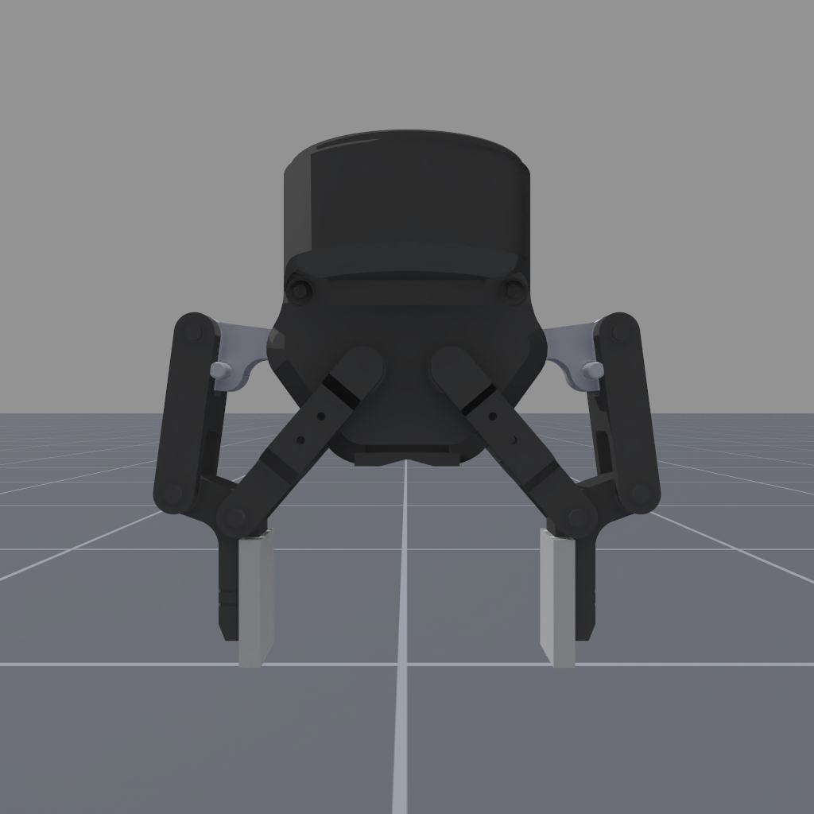
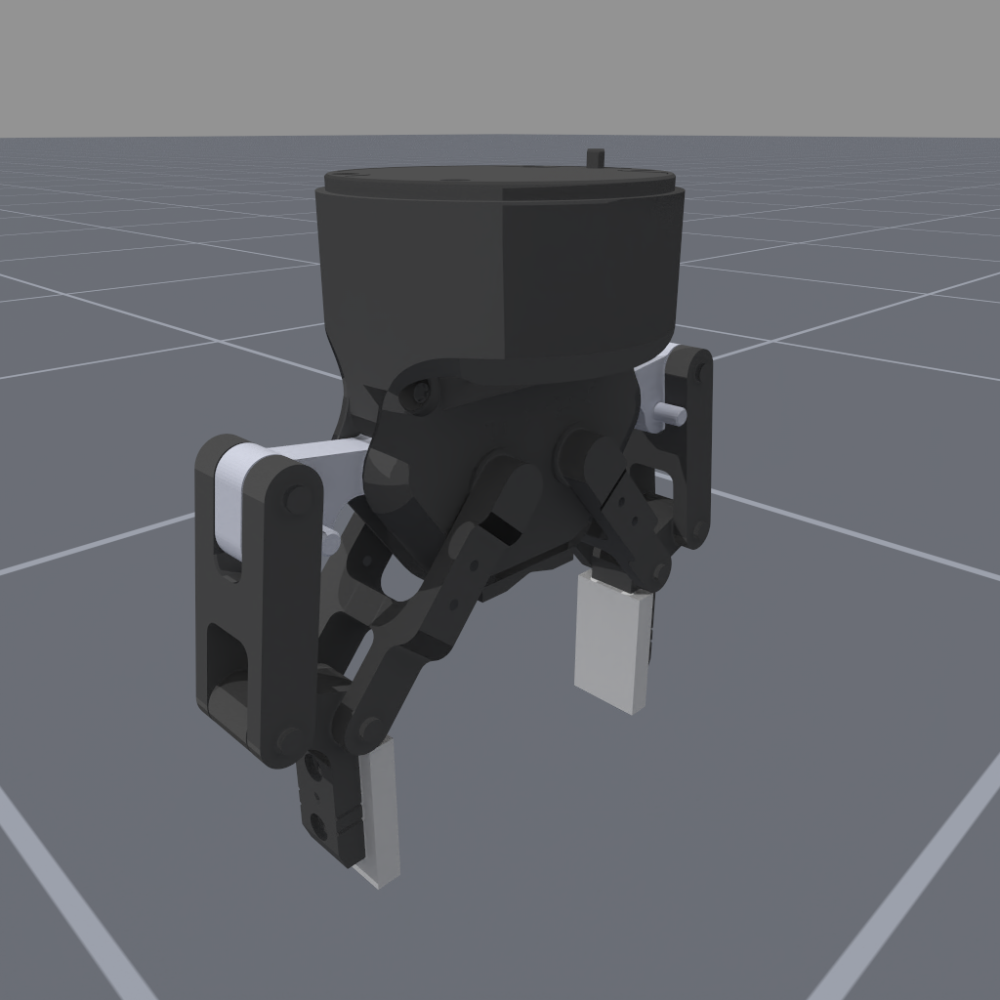
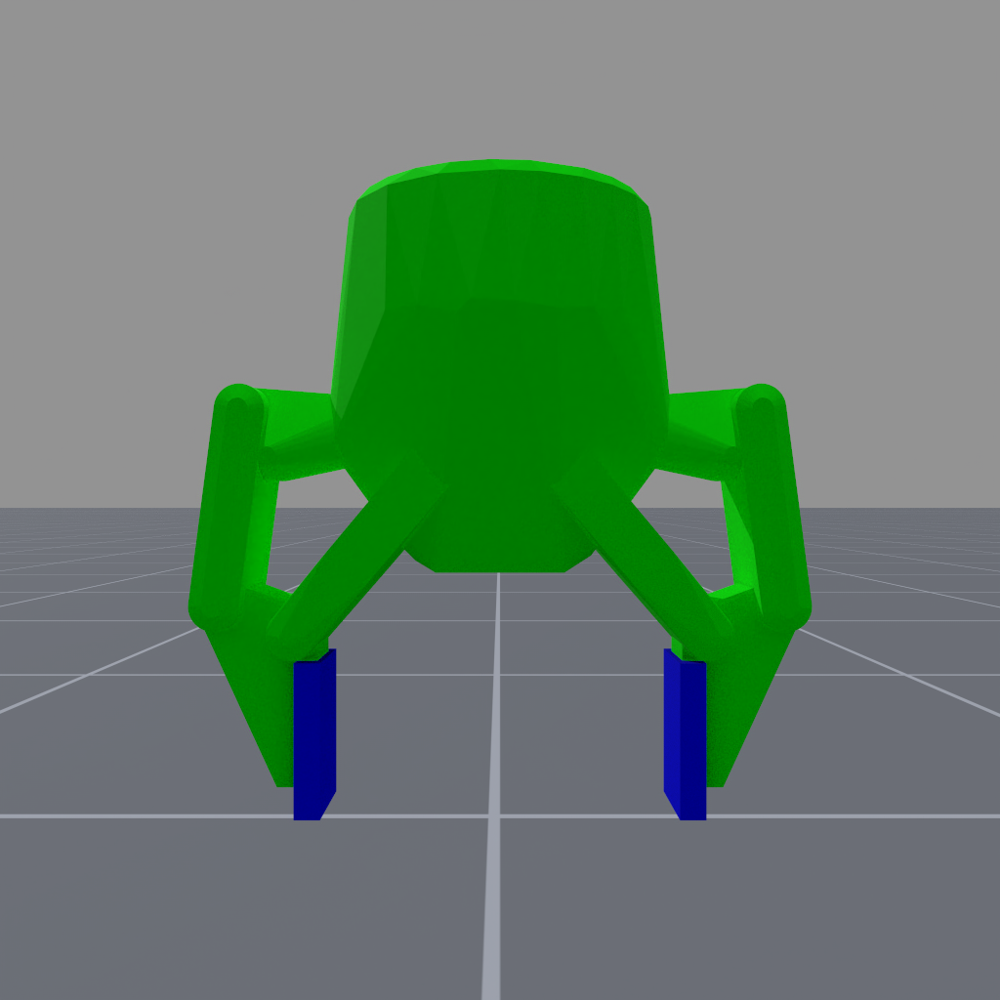
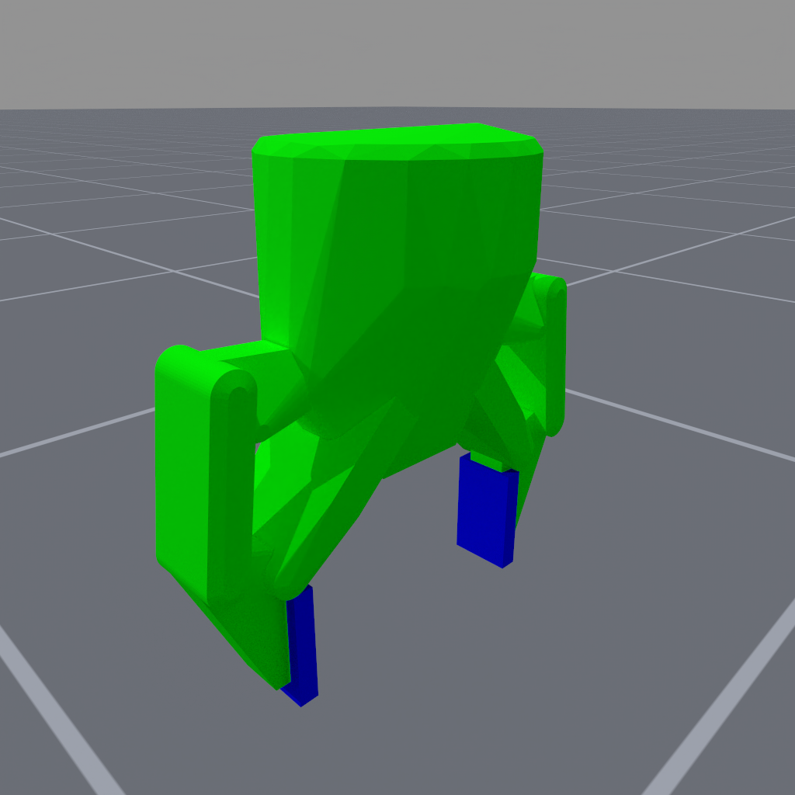

<!-- THIS IS ALL GENERATED DOCUMENTATION via generate_robot_docs.py. DO NOT MODIFY THIS FILE DIRECTLY. -->

# Floating Robotiq 2F-85 Gripper

Robot UID: `floating_robotiq_2f_85_gripper`

Agent Class Code: [https://github.com/haosulab/ManiSkill/blob/main/mani_skill/agents/robots/floating_robotiq_2f_85_gripper/floating_robotiq_2f_85_gripper.py](https://github.com/haosulab/ManiSkill/blob/main/mani_skill/agents/robots/floating_robotiq_2f_85_gripper/floating_robotiq_2f_85_gripper.py)

Quality: C (Conditionally stable, can be significantly improved)

Degrees of Freedom: 12

Controllers: `pd_joint_pos`, `pd_joint_delta_pos`

## Visuals and Collision Models

    

        
        
    

    
Visual Meshes

     
    

        
        
    

    
Collision Meshes (Green = Convex Mesh, Blue = Primitive Shape Mesh)

