<!-- THIS IS ALL GENERATED DOCUMENTATION via generate_robot_docs.py. DO NOT MODIFY THIS FILE DIRECTLY. -->

# Robots
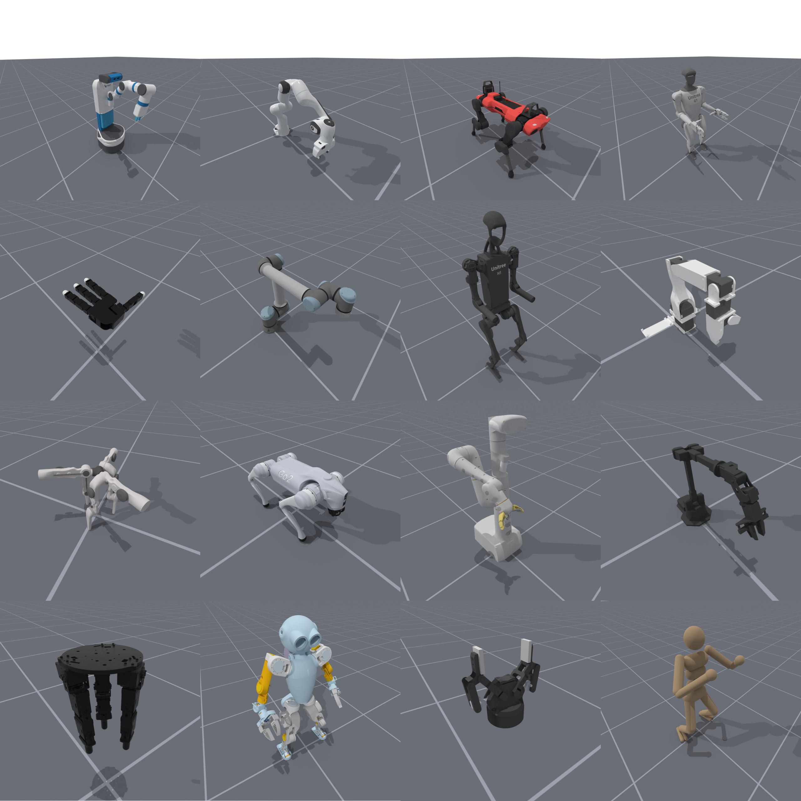


This sections here show the already built/modelled robots ready for simulation across a number of different categories. Some of them are displayed above in an empty environment using a predefined keyframe. Note that not all of these robots are used in tasks in ManiSkill, and some are not tuned for maximum efficiency yet or for sim2real transfer. You can generally assume robots that are used in existing tasks in ManiSkill are of the highest quality and already tuned.

To learn about how to load your own custom robots see [the tutorial](../user_guide/tutorials/custom_robots.md).

## Robots Table
Table of all robots modelled in ManiSkill. Click the robot's picture to see more details on the robot, including more views, collision models, controllers implemented and more.

A quality rating is also given for each robot which rates the robot on how well modelled it is. It follows the same scale as [Mujoco Menagerie](https://github.com/google-deepmind/mujoco_menagerie?tab=readme-ov-file#model-quality-and-contributing)

| Grade | Description                                                 |
|-------|-------------------------------------------------------------|
| A+    | Values are the product of proper system identification      |
| A     | Values are realistic, but have not been properly identified |
| B     | Stable, but some values are unrealistic                     |
| C     | Conditionally stable, can be significantly improved         |

Robots that are cannot be stably simulated are not included in ManiSkill at all. Most robots will have a grade of B (essentially does it look normal in simulation). While some robots may have grades of A/A+ we still strongly recommend you perform your own system ID as each robot might be a bit different.

<div class="gallery" style="display: flex; flex-wrap: wrap; gap: 10px;">

<div class="gallery-item">
    <a href="anymal_c">
        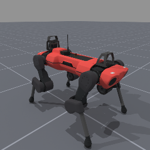
    </a>
    <div class="gallery-item-caption">
        <a href="anymal_c"><p style="margin-bottom: 0px; word-wrap: break-word; max-width: 200px; color: inherit;">Anymal C</p></a>
        <p style="margin-top: 0px;">Quality: B</p>
    </div>
</div>

<div class="gallery-item">
    <a href="allegro_hand_left">
        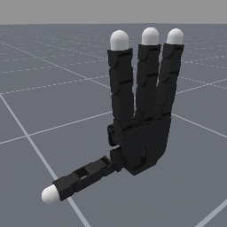
    </a>
    <div class="gallery-item-caption">
        <a href="allegro_hand_left"><p style="margin-bottom: 0px; word-wrap: break-word; max-width: 200px; color: inherit;">Allegro Hand Left</p></a>
        <p style="margin-top: 0px;">Quality: B</p>
    </div>
</div>

<div class="gallery-item">
    <a href="allegro_hand_right">
        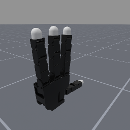
    </a>
    <div class="gallery-item-caption">
        <a href="allegro_hand_right"><p style="margin-bottom: 0px; word-wrap: break-word; max-width: 200px; color: inherit;">Allegro Hand Right</p></a>
        <p style="margin-top: 0px;">Quality: B</p>
    </div>
</div>

<div class="gallery-item">
    <a href="allegro_hand_right_touch">
        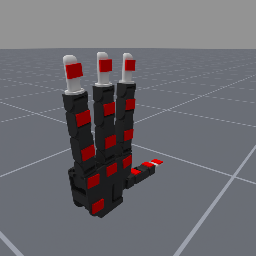
    </a>
    <div class="gallery-item-caption">
        <a href="allegro_hand_right_touch"><p style="margin-bottom: 0px; word-wrap: break-word; max-width: 200px; color: inherit;">Allegro Hand Right with Touch Sensing</p></a>
        <p style="margin-top: 0px;">Quality: B</p>
    </div>
</div>

<div class="gallery-item">
    <a href="dclaw">
        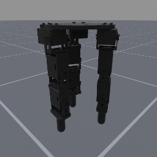
    </a>
    <div class="gallery-item-caption">
        <a href="dclaw"><p style="margin-bottom: 0px; word-wrap: break-word; max-width: 200px; color: inherit;">D'Claw</p></a>
        <p style="margin-top: 0px;">Quality: B</p>
    </div>
</div>

<div class="gallery-item">
    <a href="fetch">
        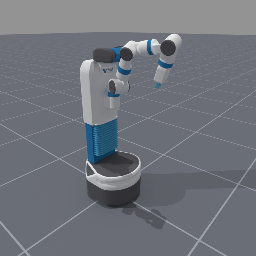
    </a>
    <div class="gallery-item-caption">
        <a href="fetch"><p style="margin-bottom: 0px; word-wrap: break-word; max-width: 200px; color: inherit;">Fetch Mobile Manipulator</p></a>
        <p style="margin-top: 0px;">Quality: B</p>
    </div>
</div>

<div class="gallery-item">
    <a href="fixed_inspire_hand_left">
        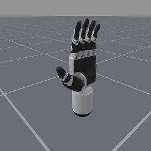
    </a>
    <div class="gallery-item-caption">
        <a href="fixed_inspire_hand_left"><p style="margin-bottom: 0px; word-wrap: break-word; max-width: 200px; color: inherit;">Fixed Inspire Hand Left</p></a>
        <p style="margin-top: 0px;">Quality: B</p>
    </div>
</div>

<div class="gallery-item">
    <a href="fixed_inspire_hand_right">
        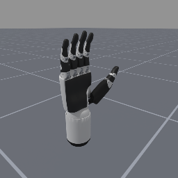
    </a>
    <div class="gallery-item-caption">
        <a href="fixed_inspire_hand_right"><p style="margin-bottom: 0px; word-wrap: break-word; max-width: 200px; color: inherit;">Fixed Inspire Hand Right</p></a>
        <p style="margin-top: 0px;">Quality: B</p>
    </div>
</div>

<div class="gallery-item">
    <a href="floating_inspire_hand_left">
        
    </a>
    <div class="gallery-item-caption">
        <a href="floating_inspire_hand_left"><p style="margin-bottom: 0px; word-wrap: break-word; max-width: 200px; color: inherit;">Floating Inspire Hand Left</p></a>
        <p style="margin-top: 0px;">Quality: B</p>
    </div>
</div>

<div class="gallery-item">
    <a href="floating_inspire_hand_right">
        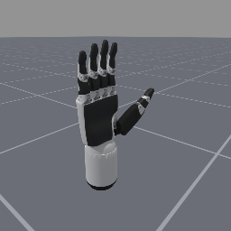
    </a>
    <div class="gallery-item-caption">
        <a href="floating_inspire_hand_right"><p style="margin-bottom: 0px; word-wrap: break-word; max-width: 200px; color: inherit;">Floating Inspire Hand Right</p></a>
        <p style="margin-top: 0px;">Quality: B</p>
    </div>
</div>

<div class="gallery-item">
    <a href="floating_panda_gripper">
        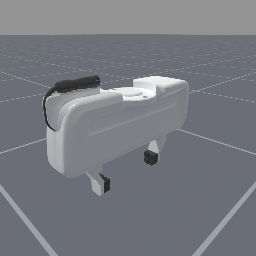
    </a>
    <div class="gallery-item-caption">
        <a href="floating_panda_gripper"><p style="margin-bottom: 0px; word-wrap: break-word; max-width: 200px; color: inherit;">Floating Panda Gripper</p></a>
        <p style="margin-top: 0px;">Quality: B</p>
    </div>
</div>

<div class="gallery-item">
    <a href="floating_robotiq_2f_85_gripper">
        
    </a>
    <div class="gallery-item-caption">
        <a href="floating_robotiq_2f_85_gripper"><p style="margin-bottom: 0px; word-wrap: break-word; max-width: 200px; color: inherit;">Floating Robotiq 2F-85 Gripper</p></a>
        <p style="margin-top: 0px;">Quality: C</p>
    </div>
</div>

<div class="gallery-item">
    <a href="googlerobot">
        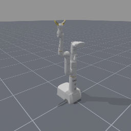
    </a>
    <div class="gallery-item-caption">
        <a href="googlerobot"><p style="margin-bottom: 0px; word-wrap: break-word; max-width: 200px; color: inherit;">Google Robot</p></a>
        <p style="margin-top: 0px;">Quality: B</p>
    </div>
</div>

<div class="gallery-item">
    <a href="humanoid">
        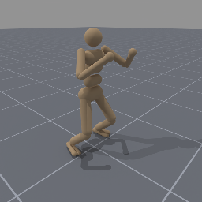
    </a>
    <div class="gallery-item-caption">
        <a href="humanoid"><p style="margin-bottom: 0px; word-wrap: break-word; max-width: 200px; color: inherit;">Mujoco Humanoid</p></a>
        <p style="margin-top: 0px;">Quality: A</p>
    </div>
</div>

<div class="gallery-item">
    <a href="koch-v1.1">
        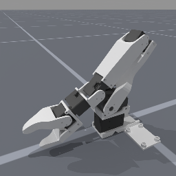
    </a>
    <div class="gallery-item-caption">
        <a href="koch-v1.1"><p style="margin-bottom: 0px; word-wrap: break-word; max-width: 200px; color: inherit;">Koch v1.1 Arm</p></a>
        <p style="margin-top: 0px;">Quality: A</p>
    </div>
</div>

<div class="gallery-item">
    <a href="panda">
        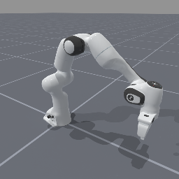
    </a>
    <div class="gallery-item-caption">
        <a href="panda"><p style="margin-bottom: 0px; word-wrap: break-word; max-width: 200px; color: inherit;">Franka Emika Panda</p></a>
        <p style="margin-top: 0px;">Quality: A</p>
    </div>
</div>

<div class="gallery-item">
    <a href="panda_stick">
        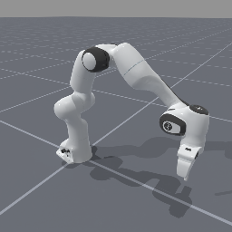
    </a>
    <div class="gallery-item-caption">
        <a href="panda_stick"><p style="margin-bottom: 0px; word-wrap: break-word; max-width: 200px; color: inherit;">Franka Emika Panda Arm with Stick Tool</p></a>
        <p style="margin-top: 0px;">Quality: A</p>
    </div>
</div>

<div class="gallery-item">
    <a href="panda_wristcam">
        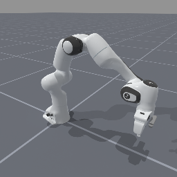
    </a>
    <div class="gallery-item-caption">
        <a href="panda_wristcam"><p style="margin-bottom: 0px; word-wrap: break-word; max-width: 200px; color: inherit;">Franka Emika Panda with Wrist Camera</p></a>
        <p style="margin-top: 0px;">Quality: A</p>
    </div>
</div>

<div class="gallery-item">
    <a href="so100">
        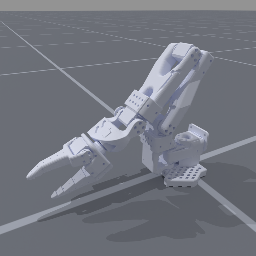
    </a>
    <div class="gallery-item-caption">
        <a href="so100"><p style="margin-bottom: 0px; word-wrap: break-word; max-width: 200px; color: inherit;">Standard Open Arm 100 (SO100)</p></a>
        <p style="margin-top: 0px;">Quality: A</p>
    </div>
</div>

<div class="gallery-item">
    <a href="stompy">
        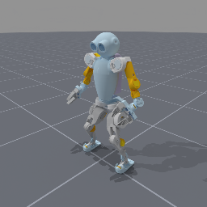
    </a>
    <div class="gallery-item-caption">
        <a href="stompy"><p style="margin-bottom: 0px; word-wrap: break-word; max-width: 200px; color: inherit;">Stompy</p></a>
        <p style="margin-top: 0px;">Quality: C</p>
    </div>
</div>

<div class="gallery-item">
    <a href="trifingerpro">
        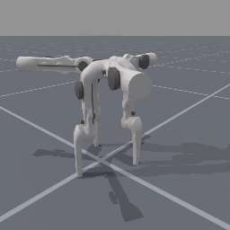
    </a>
    <div class="gallery-item-caption">
        <a href="trifingerpro"><p style="margin-bottom: 0px; word-wrap: break-word; max-width: 200px; color: inherit;">Trifinger Pro</p></a>
        <p style="margin-top: 0px;">Quality: B</p>
    </div>
</div>

<div class="gallery-item">
    <a href="ur_10e">
        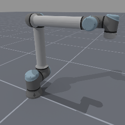
    </a>
    <div class="gallery-item-caption">
        <a href="ur_10e"><p style="margin-bottom: 0px; word-wrap: break-word; max-width: 200px; color: inherit;">UR10e</p></a>
        <p style="margin-top: 0px;">Quality: B</p>
    </div>
</div>

<div class="gallery-item">
    <a href="unitree_g1">
        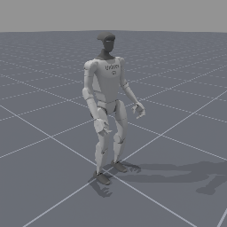
    </a>
    <div class="gallery-item-caption">
        <a href="unitree_g1"><p style="margin-bottom: 0px; word-wrap: break-word; max-width: 200px; color: inherit;">Unitree G1</p></a>
        <p style="margin-top: 0px;">Quality: B</p>
    </div>
</div>

<div class="gallery-item">
    <a href="unitree_g1_simplified_legs">
        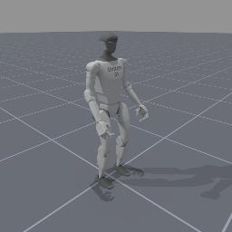
    </a>
    <div class="gallery-item-caption">
        <a href="unitree_g1_simplified_legs"><p style="margin-bottom: 0px; word-wrap: break-word; max-width: 200px; color: inherit;">Unitree G1 Simplified Legs</p></a>
        <p style="margin-top: 0px;">Quality: B</p>
    </div>
</div>

<div class="gallery-item">
    <a href="unitree_g1_simplified_upper_body">
        
    </a>
    <div class="gallery-item-caption">
        <a href="unitree_g1_simplified_upper_body"><p style="margin-bottom: 0px; word-wrap: break-word; max-width: 200px; color: inherit;">Unitree G1 Simplified Upper Body</p></a>
        <p style="margin-top: 0px;">Quality: B</p>
    </div>
</div>

<div class="gallery-item">
    <a href="unitree_go2">
        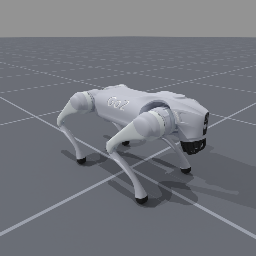
    </a>
    <div class="gallery-item-caption">
        <a href="unitree_go2"><p style="margin-bottom: 0px; word-wrap: break-word; max-width: 200px; color: inherit;">Unitree Go2</p></a>
        <p style="margin-top: 0px;">Quality: B</p>
    </div>
</div>

<div class="gallery-item">
    <a href="unitree_h1">
        
    </a>
    <div class="gallery-item-caption">
        <a href="unitree_h1"><p style="margin-bottom: 0px; word-wrap: break-word; max-width: 200px; color: inherit;">Unitree H1</p></a>
        <p style="margin-top: 0px;">Quality: B</p>
    </div>
</div>

<div class="gallery-item">
    <a href="unitree_h1_simplified">
        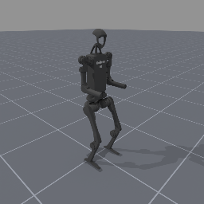
    </a>
    <div class="gallery-item-caption">
        <a href="unitree_h1_simplified"><p style="margin-bottom: 0px; word-wrap: break-word; max-width: 200px; color: inherit;">Unitree H1 Simplified Legs</p></a>
        <p style="margin-top: 0px;">Quality: B</p>
    </div>
</div>

<div class="gallery-item">
    <a href="widowx250s">
        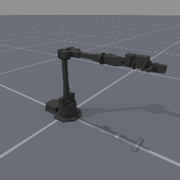
    </a>
    <div class="gallery-item-caption">
        <a href="widowx250s"><p style="margin-bottom: 0px; word-wrap: break-word; max-width: 200px; color: inherit;">WidowX 250S</p></a>
        <p style="margin-top: 0px;">Quality: B</p>
    </div>
</div>

<div class="gallery-item">
    <a href="widowxai">
        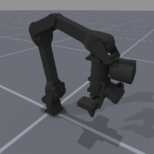
    </a>
    <div class="gallery-item-caption">
        <a href="widowxai"><p style="margin-bottom: 0px; word-wrap: break-word; max-width: 200px; color: inherit;">WidowX AI</p></a>
        <p style="margin-top: 0px;">Quality: B</p>
    </div>
</div>

<div class="gallery-item">
    <a href="widowxai_wristcam">
        
    </a>
    <div class="gallery-item-caption">
        <a href="widowxai_wristcam"><p style="margin-bottom: 0px; word-wrap: break-word; max-width: 200px; color: inherit;">WidowX AI with wrist camera</p></a>
        <p style="margin-top: 0px;">Quality: B</p>
    </div>
</div>

<div class="gallery-item">
    <a href="xarm6_nogripper">
        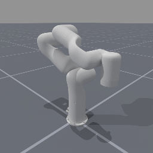
    </a>
    <div class="gallery-item-caption">
        <a href="xarm6_nogripper"><p style="margin-bottom: 0px; word-wrap: break-word; max-width: 200px; color: inherit;">XArm6 with No Gripper</p></a>
        <p style="margin-top: 0px;">Quality: A</p>
    </div>
</div>

<div class="gallery-item">
    <a href="xarm6_robotiq">
        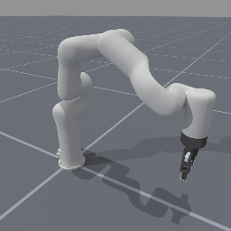
    </a>
    <div class="gallery-item-caption">
        <a href="xarm6_robotiq"><p style="margin-bottom: 0px; word-wrap: break-word; max-width: 200px; color: inherit;">XArm6 with Robotiq Gripper</p></a>
        <p style="margin-top: 0px;">Quality: A</p>
    </div>
</div>

<div class="gallery-item">
    <a href="xarm6_robotiq_wristcam">
        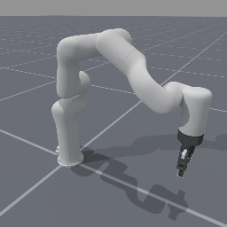
    </a>
    <div class="gallery-item-caption">
        <a href="xarm6_robotiq_wristcam"><p style="margin-bottom: 0px; word-wrap: break-word; max-width: 200px; color: inherit;">XArm6 with Robotiq Gripper and Wrist Camera</p></a>
        <p style="margin-top: 0px;">Quality: A</p>
    </div>
</div>

<div class="gallery-item">
    <a href="xarm7_ability">
        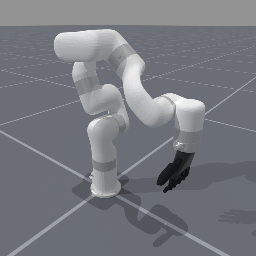
    </a>
    <div class="gallery-item-caption">
        <a href="xarm7_ability"><p style="margin-bottom: 0px; word-wrap: break-word; max-width: 200px; color: inherit;">XArm7 Ability</p></a>
        <p style="margin-top: 0px;">Quality: A</p>
    </div>
</div>

</div>

```{toctree}
:caption: Directory
:maxdepth: 1

anymal_c/index
allegro_hand_left/index
allegro_hand_right/index
allegro_hand_right_touch/index
dclaw/index
fetch/index
fixed_inspire_hand_left/index
fixed_inspire_hand_right/index
floating_inspire_hand_left/index
floating_inspire_hand_right/index
floating_panda_gripper/index
floating_robotiq_2f_85_gripper/index
googlerobot/index
humanoid/index
koch-v1.1/index
panda/index
panda_stick/index
panda_wristcam/index
so100/index
stompy/index
trifingerpro/index
ur_10e/index
unitree_g1/index
unitree_g1_simplified_legs/index
unitree_g1_simplified_upper_body/index
unitree_go2/index
unitree_h1/index
unitree_h1_simplified/index
widowx250s/index
widowxai/index
widowxai_wristcam/index
xarm6_nogripper/index
xarm6_robotiq/index
xarm6_robotiq_wristcam/index
xarm7_ability/index

```