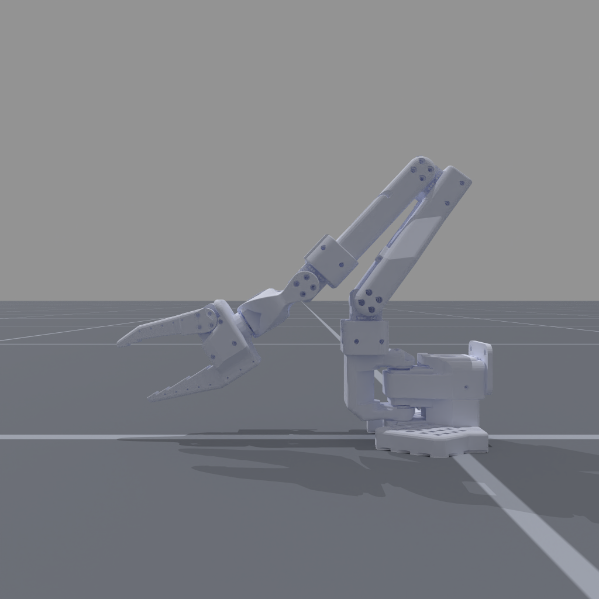
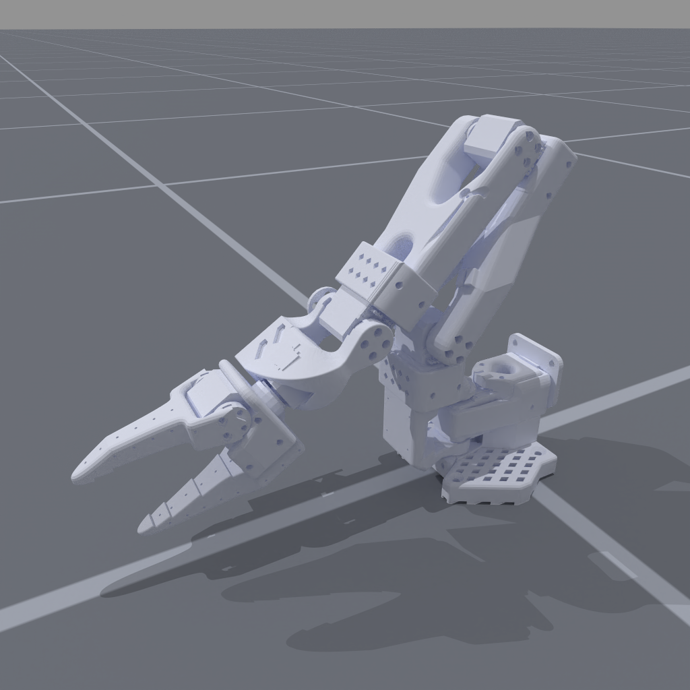
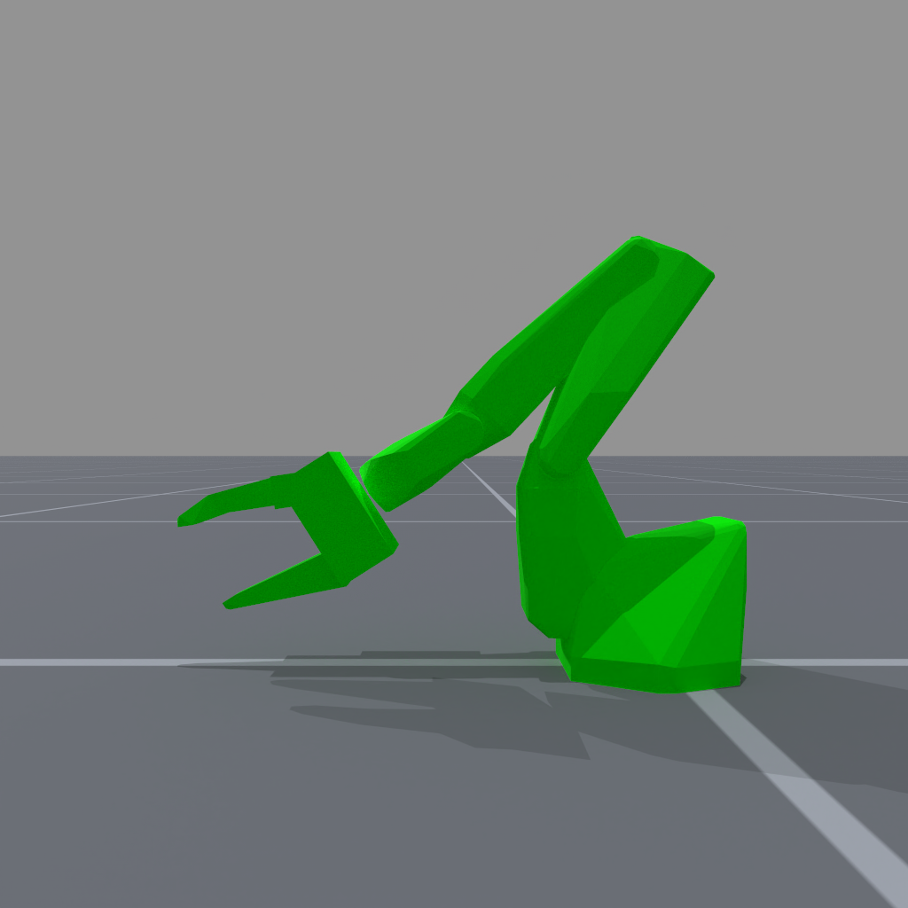
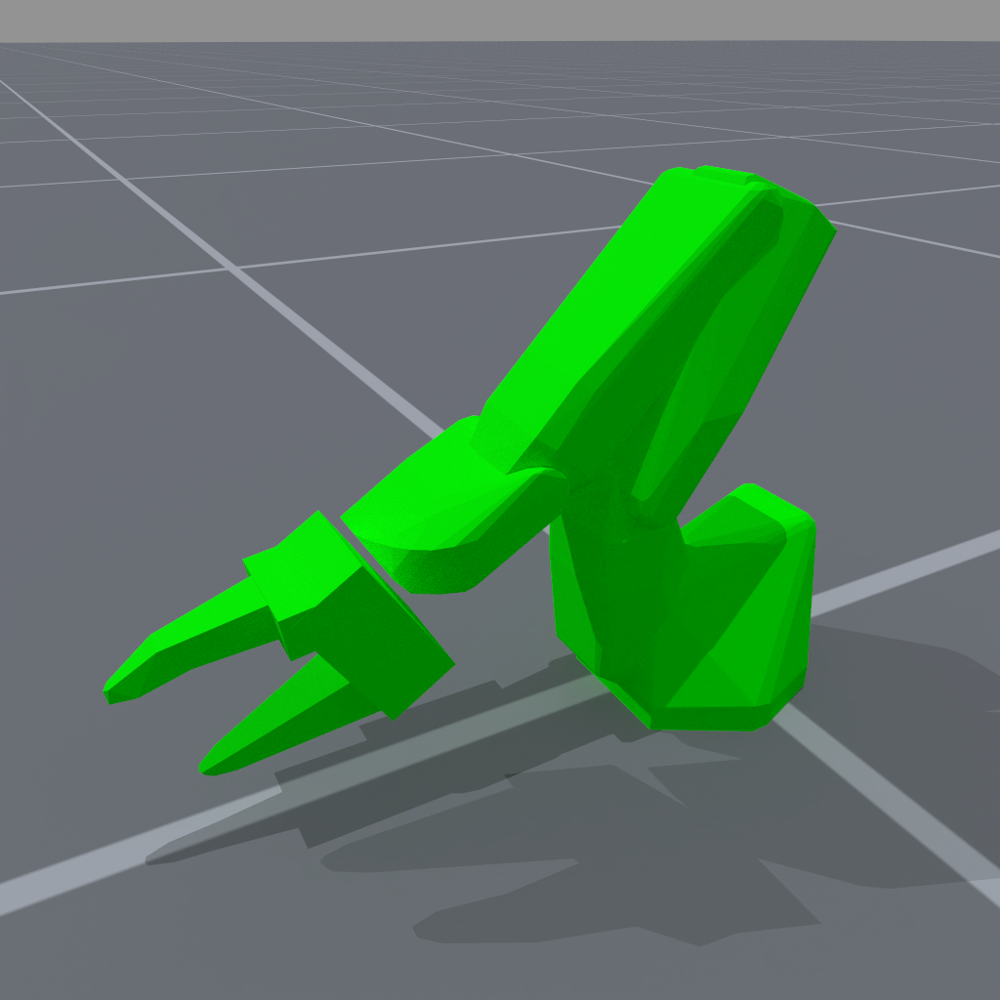

<!-- THIS IS ALL GENERATED DOCUMENTATION via generate_robot_docs.py. DO NOT MODIFY THIS FILE DIRECTLY. -->

# Standard Open Arm 100 (SO100)

Robot UID: `so100`

Agent Class Code: [https://github.com/haosulab/ManiSkill/blob/main/mani_skill/agents/robots/so100/so_100.py](https://github.com/haosulab/ManiSkill/blob/main/mani_skill/agents/robots/so100/so_100.py)

Quality: A (Values are realistic, but have not been properly identified)

Degrees of Freedom: 6

Controllers: `pd_joint_delta_pos`, `pd_joint_pos`, `pd_joint_target_delta_pos`

## Visuals and Collision Models

    

        
        
    

    
Visual Meshes

     
    

        
        
    

    
Collision Meshes (Green = Convex Mesh, Blue = Primitive Shape Mesh)

