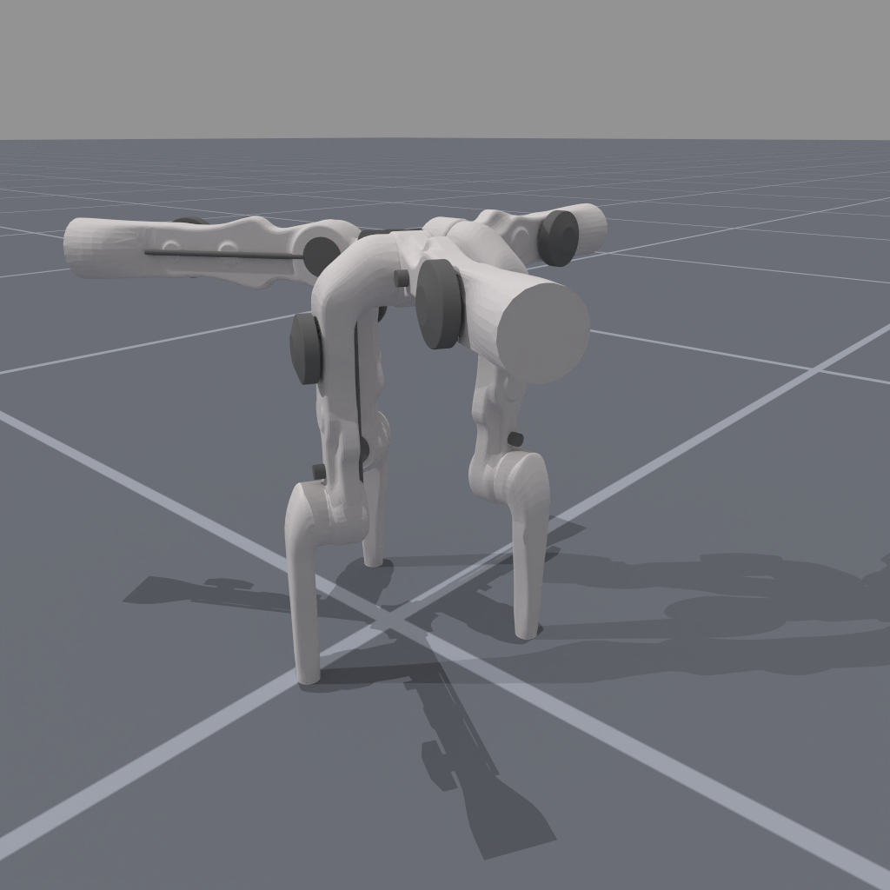
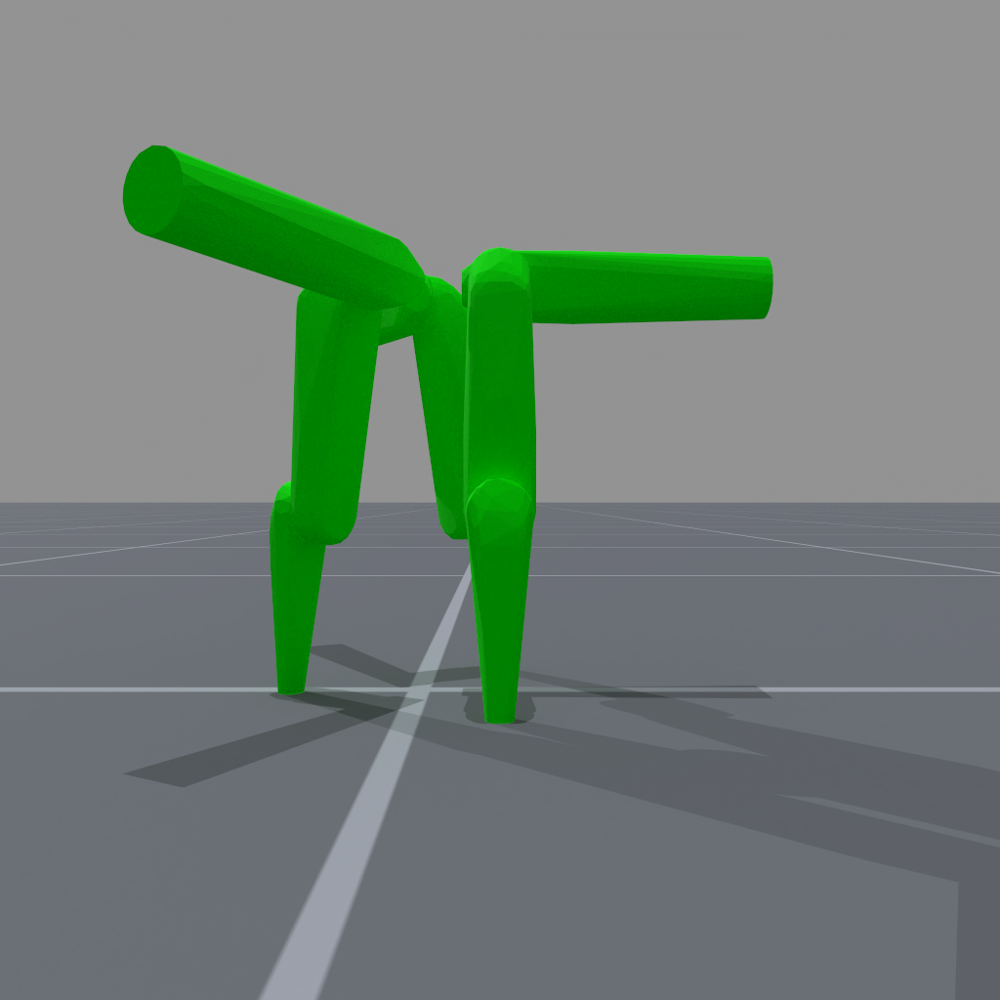
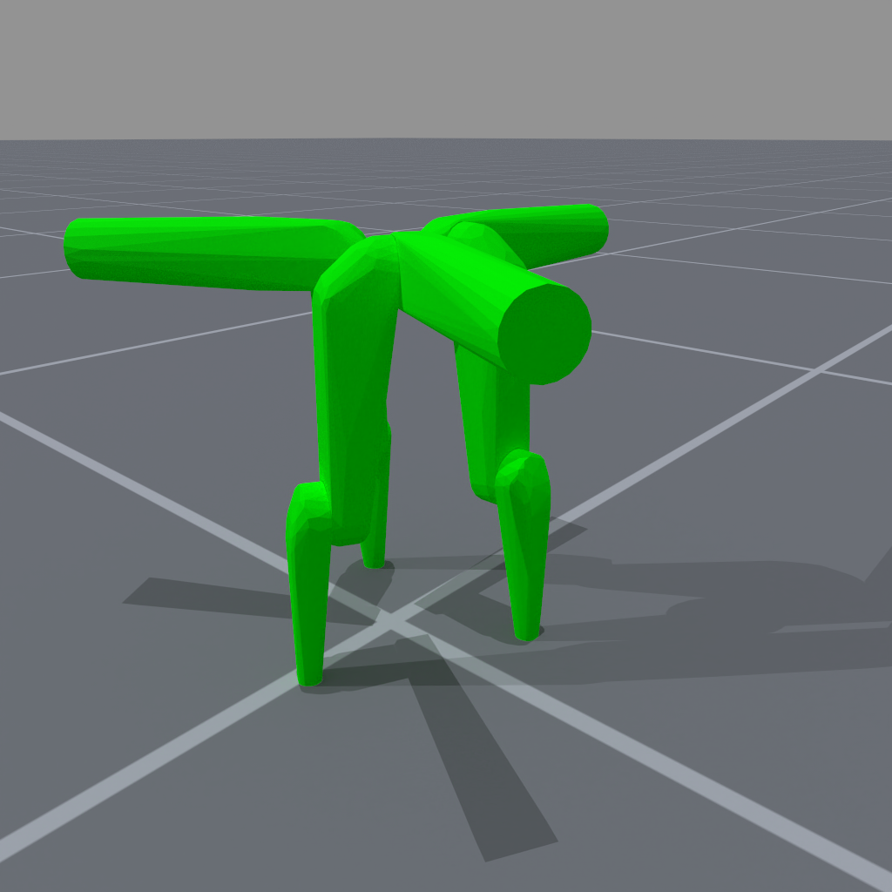

<!-- THIS IS ALL GENERATED DOCUMENTATION via generate_robot_docs.py. DO NOT MODIFY THIS FILE DIRECTLY. -->

# Trifinger Pro

Robot UID: `trifingerpro`

Agent Class Code: [https://github.com/haosulab/ManiSkill/blob/main/mani_skill/agents/robots/trifingerpro/trifingerpro.py](https://github.com/haosulab/ManiSkill/blob/main/mani_skill/agents/robots/trifingerpro/trifingerpro.py)

Quality: B (Stable, but some values are unrealistic)

Degrees of Freedom: 9

Controllers: `pd_joint_delta_pos`, `pd_joint_pos`, `pd_joint_target_delta_pos`, `pd_joint_vel`, `pd_joint_pos_vel`, `pd_joint_delta_pos_vel`

## Visuals and Collision Models

    

        
        
    

    
Visual Meshes

     
    

        
        
    

    
Collision Meshes (Green = Convex Mesh, Blue = Primitive Shape Mesh)

