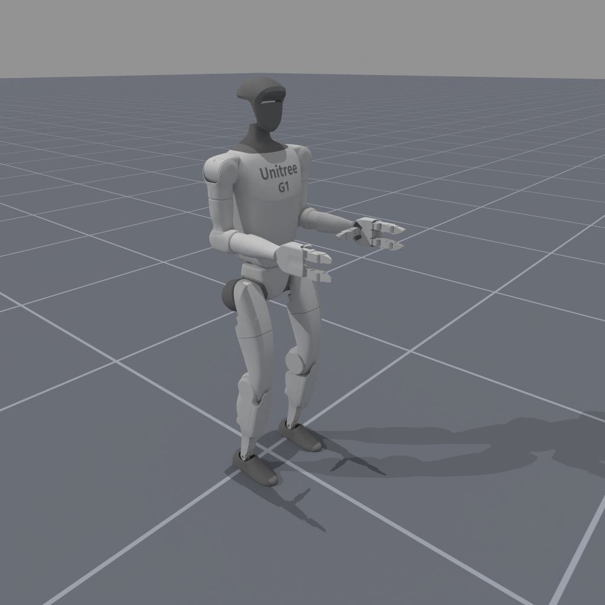
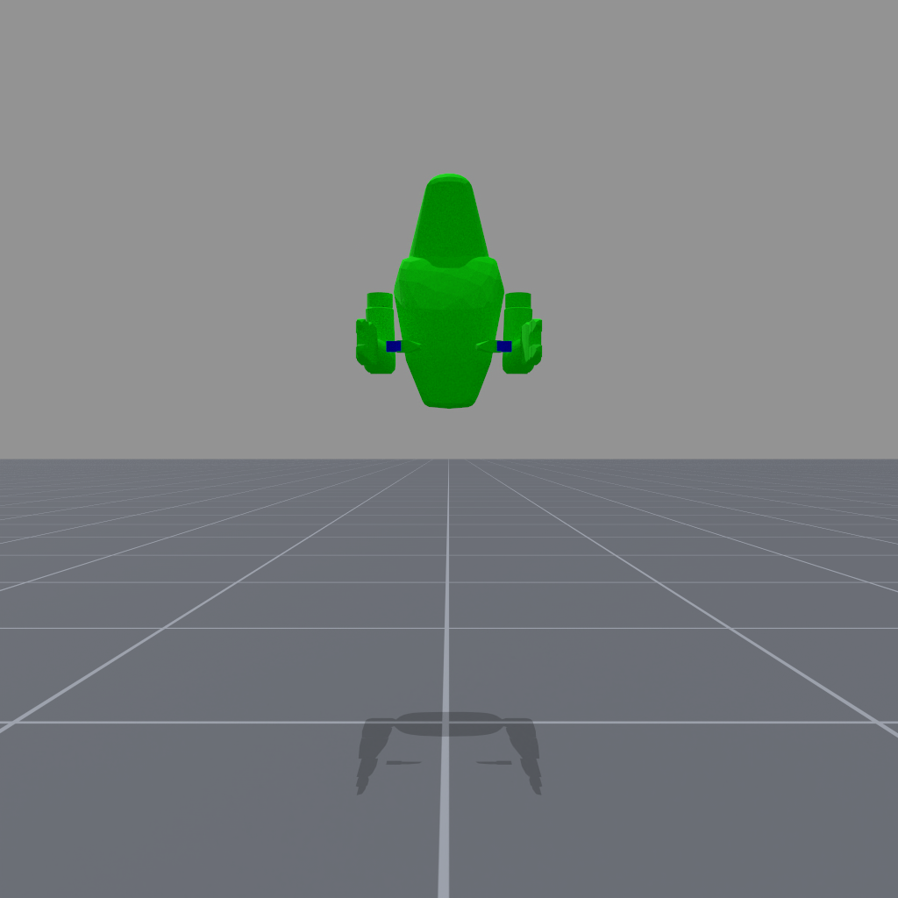
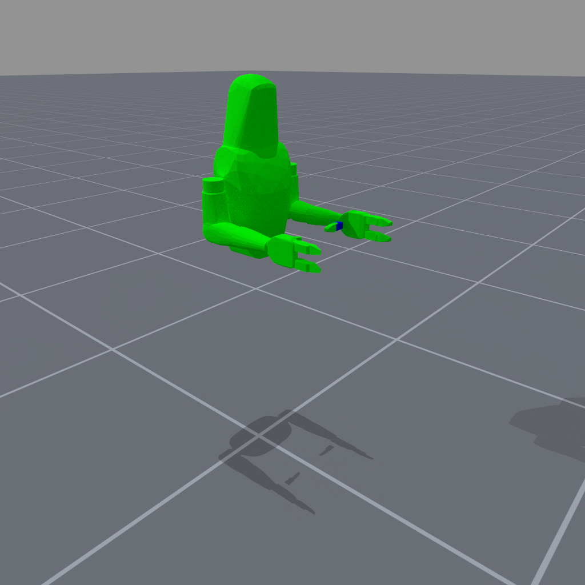

<!-- THIS IS ALL GENERATED DOCUMENTATION via generate_robot_docs.py. DO NOT MODIFY THIS FILE DIRECTLY. -->

# Unitree G1 Simplified Upper Body

Robot UID: `unitree_g1_simplified_upper_body`

Agent Class Code: [https://github.com/haosulab/ManiSkill/blob/main/mani_skill/agents/robots/unitree_g1/g1_upper_body.py](https://github.com/haosulab/ManiSkill/blob/main/mani_skill/agents/robots/unitree_g1/g1_upper_body.py)

Quality: B (Stable, but some values are unrealistic)

Degrees of Freedom: 25

Controllers: `pd_joint_delta_pos`, `pd_joint_pos`

## Visuals and Collision Models

    

        
        
    

    
Visual Meshes

     
    

        
        
    

    
Collision Meshes (Green = Convex Mesh, Blue = Primitive Shape Mesh)

