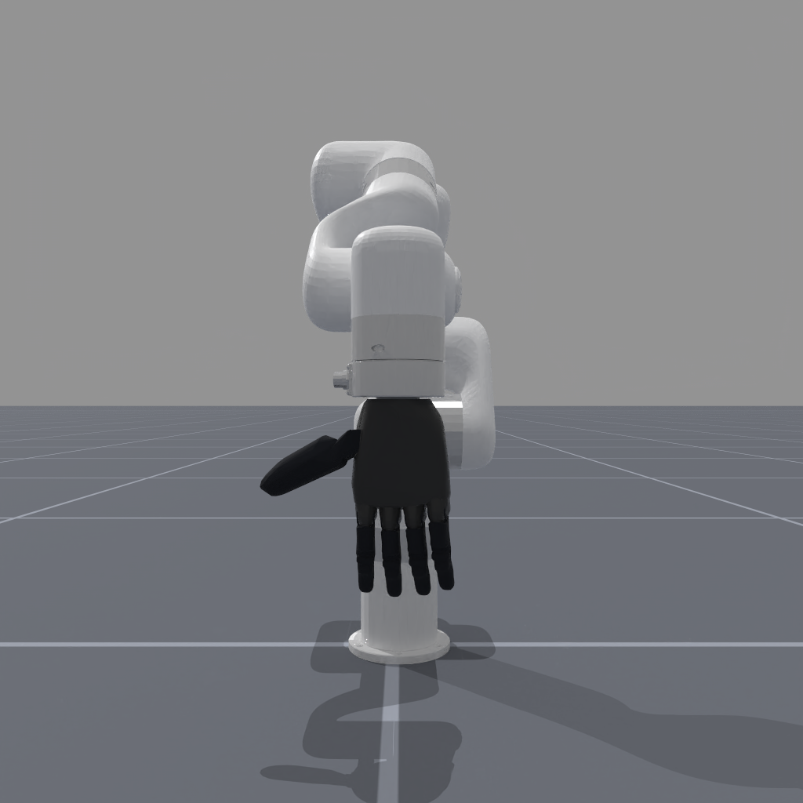
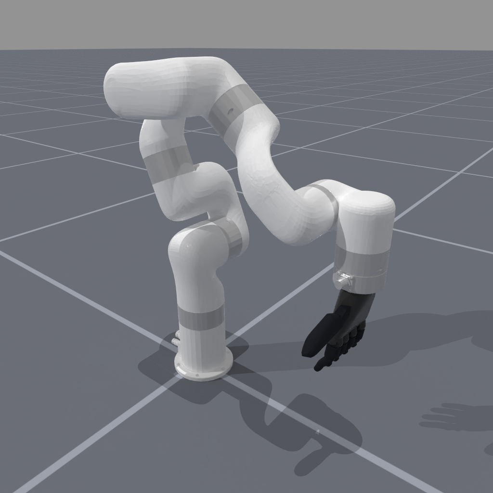
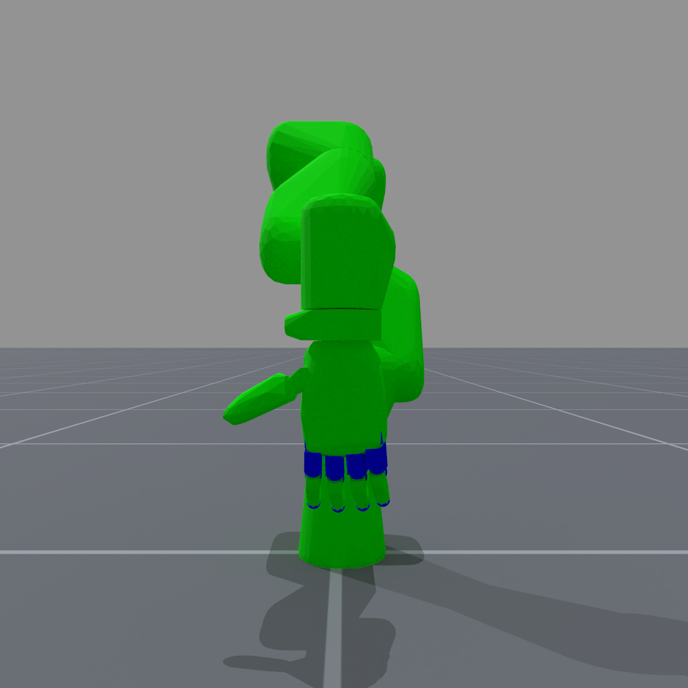
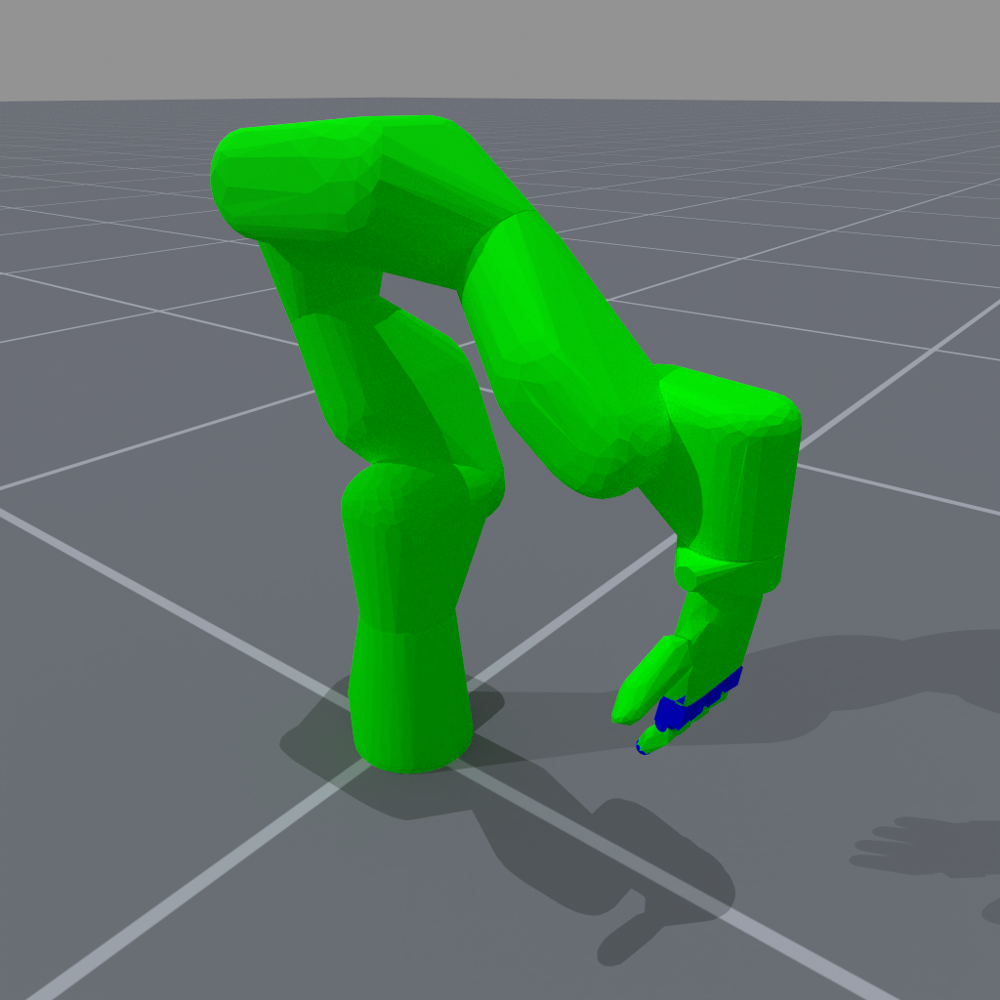

<!-- THIS IS ALL GENERATED DOCUMENTATION via generate_robot_docs.py. DO NOT MODIFY THIS FILE DIRECTLY. -->

# XArm7 Ability

Robot UID: `xarm7_ability`

Agent Class Code: [https://github.com/haosulab/ManiSkill/blob/main/mani_skill/agents/robots/xarm/xarm7_ability.py](https://github.com/haosulab/ManiSkill/blob/main/mani_skill/agents/robots/xarm/xarm7_ability.py)

Quality: A (Values are realistic, but have not been properly identified)

Degrees of Freedom: 17

Controllers: `pd_joint_delta_pos`, `pd_joint_pos`, `pd_ee_delta_pose`, `pd_ee_target_delta_pose`

## Visuals and Collision Models

    

        
        
    

    
Visual Meshes

     
    

        
        
    

    
Collision Meshes (Green = Convex Mesh, Blue = Primitive Shape Mesh)

