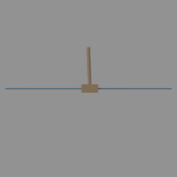
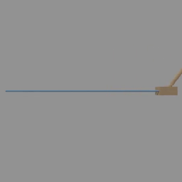

<!-- THIS IS ALL GENERATED DOCUMENTATION. DO NOT MODIFY THIS FILE -->
[asset-badge]: https://img.shields.io/badge/download%20asset-yes-blue.svg
[dense-reward-badge]: https://img.shields.io/badge/dense%20reward-yes-green.svg
[sparse-reward-badge]: https://img.shields.io/badge/sparse%20reward-yes-green.svg
[no-dense-reward-badge]: https://img.shields.io/badge/dense%20reward-no-red.svg
[no-sparse-reward-badge]: https://img.shields.io/badge/sparse%20reward-no-red.svg
[demos-badge]: https://img.shields.io/badge/demos-yes-green.svg
# Control Tasks

These are classic control tasks where the objective is to control a robot to reach a particular state, similar to the [DM Control suite](https://github.com/deepmind/dm_control) but with GPU parallelized simulation and rendering.
The document here has both a high-level overview/list of all tasks in a table as well as detailed task cards with video demonstrations after.

## Task Table
Table of all tasks/environments in this category. Task column is the environment ID, Preview is a thumbnail pair of the first and last frames of an example success demonstration. Max steps is the task's default max episode steps, generally tuned for RL workflows.
<table class="table">
<thead>
<tr class="row-odd">
<th class="head">
Task
</th>
<th class="head">
Preview
</th>
<th class="head">
Dense Reward
</th>
<th class="head">
Success/Fail Conditions
</th>
<th class="head">
Demos
</th>
<th class="head">
Max Episode Steps
</th>
</tr>
</thead>
<tbody>
<tr class="row-odd">
<td>
<a href="#ms-antrun-v1">MS-AntRun-v1</a>
</td>
<td>
 
</td>
<td>
✅
</td>
<td>
❌
</td>
<td>
❌
</td>
<td>
1000
</td>
</tr>
<tr class="row-even">
<td>
<a href="#ms-antwalk-v1">MS-AntWalk-v1</a>
</td>
<td>
 
</td>
<td>
✅
</td>
<td>
❌
</td>
<td>
❌
</td>
<td>
1000
</td>
</tr>
<tr class="row-odd">
<td>
<a href="#ms-cartpolebalance-v1">MS-CartpoleBalance-v1</a>
</td>
<td>
 
</td>
<td>
✅
</td>
<td>
✅
</td>
<td>
❌
</td>
<td>
1000
</td>
</tr>
<tr class="row-even">
<td>
<a href="#ms-cartpoleswingup-v1">MS-CartpoleSwingUp-v1</a>
</td>
<td>
 
</td>
<td>
✅
</td>
<td>
❌
</td>
<td>
❌
</td>
<td>
1000
</td>
</tr>
<tr class="row-odd">
<td>
<a href="#ms-hopperhop-v1">MS-HopperHop-v1</a>
</td>
<td>
 
</td>
<td>
✅
</td>
<td>
✅
</td>
<td>
❌
</td>
<td>
600
</td>
</tr>
<tr class="row-even">
<td>
<a href="#ms-hopperstand-v1">MS-HopperStand-v1</a>
</td>
<td>
 
</td>
<td>
✅
</td>
<td>
✅
</td>
<td>
❌
</td>
<td>
600
</td>
</tr>
<tr class="row-odd">
<td>
<a href="#ms-humanoidrun-v1">MS-HumanoidRun-v1</a>
</td>
<td>
 
</td>
<td>
✅
</td>
<td>
❌
</td>
<td>
❌
</td>
<td>
1000
</td>
</tr>
<tr class="row-even">
<td>
<a href="#ms-humanoidstand-v1">MS-HumanoidStand-v1</a>
</td>
<td>
 
</td>
<td>
✅
</td>
<td>
❌
</td>
<td>
❌
</td>
<td>
1000
</td>
</tr>
<tr class="row-odd">
<td>
<a href="#ms-humanoidwalk-v1">MS-HumanoidWalk-v1</a>
</td>
<td>
 
</td>
<td>
✅
</td>
<td>
❌
</td>
<td>
❌
</td>
<td>
1000
</td>
</tr>
</tbody>
</table>

## MS-AntRun-v1

![dense-reward][dense-reward-badge]
![no-sparse-reward][no-sparse-reward-badge]
:::{dropdown} Task Card
:icon: note
:color: primary

**Task Description:**
Ant moves in x direction at 4 m/s

**Randomizations:**
- Ant qpos and qvel have added noise from uniform distribution [-1e-2, 1e-2]

**Success Conditions:**
- No specific success conditions.
:::

## MS-AntWalk-v1

![dense-reward][dense-reward-badge]
![no-sparse-reward][no-sparse-reward-badge]
:::{dropdown} Task Card
:icon: note
:color: primary

**Task Description:**
Ant moves in x direction at 0.5 m/s

**Randomizations:**
- Ant qpos and qvel have added noise from uniform distribution [-1e-2, 1e-2]

**Success Conditions:**
- No specific success conditions.
:::

## MS-CartpoleBalance-v1

![dense-reward][dense-reward-badge]
![sparse-reward][sparse-reward-badge]
:::{dropdown} Task Card
:icon: note
:color: primary

**Task Description:**
Use the Cartpole robot to balance a pole on a cart.

**Randomizations:**
- Pole direction is randomized around the vertical axis. the range is [-0.05, 0.05] radians.

**Fail Conditions:**
- Pole is lower than the horizontal plane
:::

<video preload="none" controls="True" width="100%" style="max-width: min(100%, 512px);" poster="../../_static/env_thumbnails/MS-CartpoleBalance-v1_rt_thumb_first.png">
<source src="https://github.com/haosulab/ManiSkill/raw/main/figures/environment_demos/MS-CartpoleBalance-v1_rt.mp4" type="video/mp4">
</video>

## MS-CartpoleSwingUp-v1

![dense-reward][dense-reward-badge]
![no-sparse-reward][no-sparse-reward-badge]
:::{dropdown} Task Card
:icon: note
:color: primary

**Task Description:**
Use the Cartpole robot to swing up a pole on a cart.

**Randomizations:**
- Pole direction is randomized around the whole circle. the range is [-pi, pi] radians.

**Success Conditions:**
- No specific success conditions. The task is considered successful if the pole is upright for the whole episode.
:::

## MS-HopperHop-v1

![dense-reward][dense-reward-badge]
![sparse-reward][sparse-reward-badge]
:::{dropdown} Task Card
:icon: note
:color: primary

**Task Description:**
Hopper robot stays upright and moves in positive x direction with hopping motion

**Randomizations:**
- Hopper robot is randomly rotated [-pi, pi] radians about y axis.
- Hopper qpos are uniformly sampled within their allowed ranges

**Success Conditions:**
- No specific success conditions. The task is considered successful if the pole is upright for the whole episode.
:::

## MS-HopperStand-v1

![dense-reward][dense-reward-badge]
![sparse-reward][sparse-reward-badge]
:::{dropdown} Task Card
:icon: note
:color: primary

**Task Description:**
Hopper robot stands upright

**Randomizations:**
- Hopper robot is randomly rotated [-pi, pi] radians about y axis.
- Hopper qpos are uniformly sampled within their allowed ranges

**Success Conditions:**
- No specific success conditions.
:::

## MS-HumanoidRun-v1

![dense-reward][dense-reward-badge]
![no-sparse-reward][no-sparse-reward-badge]
:::{dropdown} Task Card
:icon: note
:color: primary

**Task Description:**
Humanoid moves in x direction at running pace

**Randomizations:**
- Humanoid qpos and qvel have added noise from uniform distribution [-1e-2, 1e-2]

**Fail Conditions:**
- Humanoid robot torso link leaves z range [0.7, 1.0]
:::

## MS-HumanoidStand-v1

![dense-reward][dense-reward-badge]
![no-sparse-reward][no-sparse-reward-badge]
:::{dropdown} Task Card
:icon: note
:color: primary

**Task Description:**
Humanoid robot stands upright

**Randomizations:**
- Humanoid robot is randomly rotated [-pi, pi] radians about z axis.
- Humanoid qpos and qvel have added noise from uniform distribution [-1e-2, 1e-2]

**Fail Conditions:**
- Humanoid robot torso link leaves z range [0.7, 1.0]
:::

## MS-HumanoidWalk-v1

![dense-reward][dense-reward-badge]
![no-sparse-reward][no-sparse-reward-badge]
:::{dropdown} Task Card
:icon: note
:color: primary

**Task Description:**
Humanoid moves in x direction at walking pace

**Randomizations:**
- Humanoid qpos and qvel have added noise from uniform distribution [-1e-2, 1e-2]

**Fail Conditions:**
- Humanoid robot torso link leaves z range [0.7, 1.0]
:::
