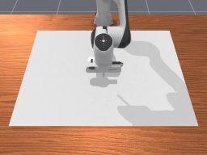
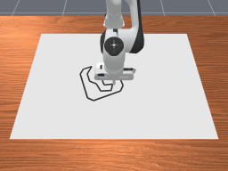
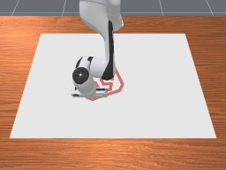
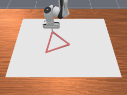

<!-- THIS IS ALL GENERATED DOCUMENTATION. DO NOT MODIFY THIS FILE -->
[asset-badge]: https://img.shields.io/badge/download%20asset-yes-blue.svg
[dense-reward-badge]: https://img.shields.io/badge/dense%20reward-yes-green.svg
[sparse-reward-badge]: https://img.shields.io/badge/sparse%20reward-yes-green.svg
[no-dense-reward-badge]: https://img.shields.io/badge/dense%20reward-no-red.svg
[no-sparse-reward-badge]: https://img.shields.io/badge/sparse%20reward-no-red.svg
[demos-badge]: https://img.shields.io/badge/demos-yes-green.svg
# Drawing Tasks

These are tasks where the robot is controlled to draw a specific shape or pattern.
The document here has both a high-level overview/list of all tasks in a table as well as detailed task cards with video demonstrations after.

## Task Table
Table of all tasks/environments in this category. Task column is the environment ID, Preview is a thumbnail pair of the first and last frames of an example success demonstration. Max steps is the task's default max episode steps, generally tuned for RL workflows.
<table class="table">
<thead>
<tr class="row-odd">
<th class="head">
Task
</th>
<th class="head">
Preview
</th>
<th class="head">
Dense Reward
</th>
<th class="head">
Success/Fail Conditions
</th>
<th class="head">
Demos
</th>
<th class="head">
Max Episode Steps
</th>
</tr>
</thead>
<tbody>
<tr class="row-odd">
<td>
<a href="#tabletopfreedraw-v1">TableTopFreeDraw-v1</a>
</td>
<td>
 
</td>
<td>
❌
</td>
<td>
❌
</td>
<td>
❌
</td>
<td>
1000
</td>
</tr>
<tr class="row-odd">
<td>
<a href="#drawsvg-v1">DrawSVG-v1</a>
</td>
<td>
 
</td>
<td>
❌
</td>
<td>
✅
</td>
<td>
❌
</td>
<td>
500
</td>
</tr>
<tr class="row-odd">
<td>
<a href="#drawtriangle-v1">DrawTriangle-v1</a>
</td>
<td>
 
</td>
<td>
❌
</td>
<td>
✅
</td>
<td>
✅
</td>
<td>
300
</td>
</tr>
</tbody>
</table>

## TableTopFreeDraw-v1

![no-dense-reward][no-dense-reward-badge]
![no-sparse-reward][no-sparse-reward-badge]
:::{dropdown} Task Card
:icon: note
:color: primary

**Task Description:**
Instantiates a table with a white canvas on it and a robot with a stick that draws red lines. This environment is primarily for a reference / for others to copy
to make their own drawing tasks.

**Randomizations:**
None

**Success Conditions:**
None

**Goal Specification:**
None
:::

<video preload="none" controls="True" width="100%" style="max-width: min(100%, 512px);" poster="../../_static/env_thumbnails/TableTopFreeDraw-v1_rt_thumb_first.png">
<source src="https://github.com/haosulab/ManiSkill/raw/main/figures/environment_demos/TableTopFreeDraw-v1_rt.mp4" type="video/mp4">
</video>

## DrawSVG-v1

![no-dense-reward][no-dense-reward-badge]
![sparse-reward][sparse-reward-badge]
:::{dropdown} Task Card
:icon: note
:color: primary

**Task Description:**
Instantiates a table with a white canvas on it and a svg path specified with an outline. A robot with a stick is to draw the triangle with a red line.

**Randomizations:**
- the goal svg's position on the xy-plane is randomized
- the goal svg's z-rotation is randomized in range [0, 2 $\pi$]

**Success Conditions:**
- the drawn points by the robot are within a euclidean distance of 0.05m with points on the goal svg
:::

<video preload="none" controls="True" width="100%" style="max-width: min(100%, 512px);" poster="../../_static/env_thumbnails/DrawSVG-v1_rt_thumb_first.png">
<source src="https://github.com/haosulab/ManiSkill/raw/main/figures/environment_demos/DrawSVG-v1_rt.mp4" type="video/mp4">
</video>

## DrawTriangle-v1

![no-dense-reward][no-dense-reward-badge]
![sparse-reward][sparse-reward-badge]
![demos][demos-badge]
:::{dropdown} Task Card
:icon: note
:color: primary

**Task Description:**
Instantiates a table with a white canvas on it and a goal triangle with an outline. A robot with a stick is to draw the triangle with a red line.

**Randomizations:**
- the goal triangle's position on the xy-plane is randomized
- the goal triangle's z-rotation is randomized in range [0, 2 $\pi$]

**Success Conditions:**
- the drawn points by the robot are within a euclidean distance of 0.05m with points on the goal triangle
:::

<video preload="none" controls="True" width="100%" style="max-width: min(100%, 512px);" poster="../../_static/env_thumbnails/DrawTriangle-v1_rt_thumb_first.png">
<source src="https://github.com/haosulab/ManiSkill/raw/main/figures/environment_demos/DrawTriangle-v1_rt.mp4" type="video/mp4">
</video>

