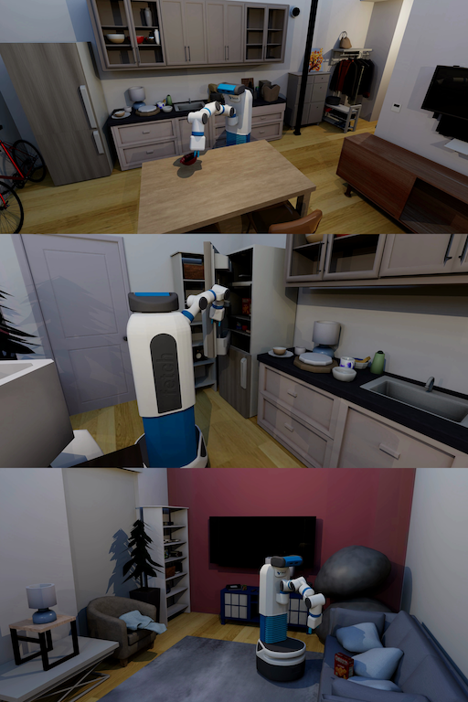

<!-- THIS IS ALL GENERATED DOCUMENTATION. DO NOT MODIFY THIS FILE -->
[asset-badge]: https://img.shields.io/badge/download%20asset-yes-blue.svg
[dense-reward-badge]: https://img.shields.io/badge/dense%20reward-yes-green.svg
[sparse-reward-badge]: https://img.shields.io/badge/sparse%20reward-yes-green.svg
[no-dense-reward-badge]: https://img.shields.io/badge/dense%20reward-no-red.svg
[no-sparse-reward-badge]: https://img.shields.io/badge/sparse%20reward-no-red.svg
[demos-badge]: https://img.shields.io/badge/demos-yes-green.svg
# External Benchmarks/Tasks

These are tasks and external libraries contributed by the community, built in ManiSkill.
The document here has both a high-level overview/list of each project in a table as well as detailed task cards with video demonstrations after.

## Task Table
Table of all tasks/environments in this category. Task column is the environment ID, Preview is a thumbnail pair of the first and last frames of an example success demonstration. Max steps is the task's default max episode steps, generally tuned for RL workflows.
<table class="table">
<thead>
<tr class="row-odd">
<th class="head"><p>Task</p></th>
<th class="head"><p>Preview</p></th>
<th class="head"><p>Dense Reward</p></th>
<th class="head"><p>Success/Fail Conditions</p></th>
<th class="head"><p>Demos</p></th>
<th class="head"><p>Max Episode Steps</p></th>
</tr>
</thead>
<tbody>
<tr class="row-odd">
<td><p><a href="https://arth-shukla.github.io/mshab/" target="_blank">ManiSkill-HAB</a></p></td>
<td><div style='display:flex;gap:4px;align-items:center'></td>
<td><p>✅</p></td>
<td><p>✅</p></td>
<td><p>✅</p></td>
<td><p>Full Task: 1200-2000<br /><br />Subtasks: 200</p></td>
</tr>
</tbody>
</table>

## ManiSkill-HAB

**[Paper](https://arxiv.org/abs/2412.13211)** | **[Website](https://arth-shukla.github.io/mshab)** | **[Code](https://github.com/arth-shukla/mshab)** | **[Models](https://huggingface.co/arth-shukla/mshab_checkpoints)** | **[Dataset](https://arth-shukla.github.io/mshab/#dataset-section)**

![dense-reward][dense-reward-badge]
![sparse-reward][sparse-reward-badge]
![demos][demos-badge]
:::{dropdown} Task Card
:icon: note
:color: primary

**Task Description:**

ManiSkill-HAB contains 3 long-horizon tasks:
- **TidyHouse**: Move 5 target objects to different open receptacles (e.g. table, counter, etc).
- **PrepareGroceries**: Move 2 objects from the opened fridge to goal positions on the counter,
then 1 object from the counter to the fridge.
- **SetTable**: Move 1 bowl from the closed drawer to the dining table and 1 apple from the
closed fridge to the same dining table.

These tasks are split into 4 subtasks: Pick Place, Open, and Close.

**Randomizations:**
- Target object/articulation/goal (depending on subtask)
- Base x/y position and z rotation, arm and torso qpos noise

**Success Conditions:**
- Pick: Object grasped, end-effector at rest position, robot static
- Place: Object within 15cm of goal position, end-effector at rest position, robot static
- Open: Articulation open, end-effector at rest position, robot static
- Close: Articulation closed, end-effector at rest position, robot static

**Fail Conditions:**
- Robot exceeds cumulative collision force threshold (5000N for Pick, 7500N for Place, 10,000N for Open/Close)

**Citation**
```latex
@article{shukla2024maniskillhab,
	author		 = {Arth Shukla and Stone Tao and Hao Su},
	title        = {ManiSkill-HAB: A Benchmark for Low-Level Manipulation in Home Rearrangement Tasks},
	journal      = {CoRR},
	volume       = {abs/2412.13211},
	year         = {2024},
	url          = {https://doi.org/10.48550/arXiv.2412.13211},
	doi          = {10.48550/ARXIV.2412.13211},
	eprinttype   = {arXiv},
	eprint       = {2412.13211},
	timestamp    = {Mon, 09 Dec 2024 01:29:24 +0100},
	biburl       = {https://dblp.org/rec/journals/corr/abs-2412-13211.bib},
	bibsource    = {dblp computer science bibliography, https://dblp.org}
}
```
:::

<div style="display: flex; justify-content: center;">
<video preload="none" controls="True" width="100%" style="max-width: min(100%, 512px);" poster="../../_static/env_thumbnails/ManiSkill-HAB_rt_poster.png">
<source src="https://github.com/haosulab/ManiSkill/raw/main/figures/environment_demos/ManiSkill-HAB_rt.mp4" type="video/mp4">
</video>
</div>
