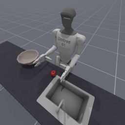
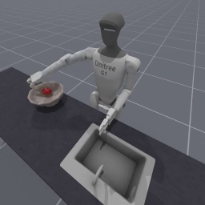
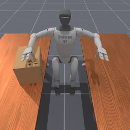
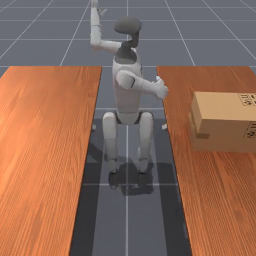

<!-- THIS IS ALL GENERATED DOCUMENTATION. DO NOT MODIFY THIS FILE -->
[asset-badge]: https://img.shields.io/badge/download%20asset-yes-blue.svg
[dense-reward-badge]: https://img.shields.io/badge/dense%20reward-yes-green.svg
[sparse-reward-badge]: https://img.shields.io/badge/sparse%20reward-yes-green.svg
[no-dense-reward-badge]: https://img.shields.io/badge/dense%20reward-no-red.svg
[no-sparse-reward-badge]: https://img.shields.io/badge/sparse%20reward-no-red.svg
[demos-badge]: https://img.shields.io/badge/demos-yes-green.svg
# Humanoid Tasks
Both real-world humanoids and the Mujoco humanoid are supported in ManiSkill, and we are still in the process of adding more tasks. Humanoid category of tasks generally considers control of robots with two legs and two arms.
The document here has both a high-level overview/list of all tasks in a table as well as detailed task cards with video demonstrations after.

## Task Table
Table of all tasks/environments in this category. Task column is the environment ID, Preview is a thumbnail pair of the first and last frames of an example success demonstration. Max steps is the task's default max episode steps, generally tuned for RL workflows.
<table class="table">
<thead>
<tr class="row-odd">
<th class="head">
Task
</th>
<th class="head">
Preview
</th>
<th class="head">
Dense Reward
</th>
<th class="head">
Success/Fail Conditions
</th>
<th class="head">
Demos
</th>
<th class="head">
Max Episode Steps
</th>
</tr>
</thead>
<tbody>
<tr class="row-odd">
<td>
<a href="#unitreeg1placeappleinbowl-v1">UnitreeG1PlaceAppleInBowl-v1</a>
</td>
<td>
 
</td>
<td>
✅
</td>
<td>
✅
</td>
<td>
❌
</td>
<td>
100
</td>
</tr>
<tr class="row-odd">
<td>
<a href="#unitreeg1stand-v1">UnitreeG1Stand-v1</a>
</td>
<td>
 
</td>
<td>
❌
</td>
<td>
✅
</td>
<td>
❌
</td>
<td>
1000
</td>
</tr>
<tr class="row-even">
<td>
<a href="#unitreeh1stand-v1">UnitreeH1Stand-v1</a>
</td>
<td>
 
</td>
<td>
❌
</td>
<td>
✅
</td>
<td>
❌
</td>
<td>
1000
</td>
</tr>
<tr class="row-odd">
<td>
<a href="#unitreeg1transportbox-v1">UnitreeG1TransportBox-v1</a>
</td>
<td>
 
</td>
<td>
✅
</td>
<td>
✅
</td>
<td>
❌
</td>
<td>
100
</td>
</tr>
</tbody>
</table>

## UnitreeG1PlaceAppleInBowl-v1

![dense-reward][dense-reward-badge]
![sparse-reward][sparse-reward-badge]
:::{dropdown} Task Card
:icon: note
:color: primary

**Task Description:**
Control the humanoid unitree G1 robot to grab an apple with its right arm and place it in a bowl to the side

**Randomizations:**
- the bowl's xy position is randomized on top of a table in the region [0.025, 0.025] x [-0.025, -0.025]. It is placed flat on the table
- the apple's xy position is randomized on top of a table in the region [0.025, 0.025] x [-0.025, -0.025]. It is placed flat on the table
- the apple's z-axis rotation is randomized to a random angle

**Success Conditions:**
- the apple position is within 0.05m euclidean distance of the bowl's position.
- the robot's right hand is kept outside the bowl and is above it by at least 0.125m.

**Goal Specification:**
- The bowl's 3D position
:::

<video preload="none" controls="True" width="100%" style="max-width: min(100%, 512px);" poster="../../_static/env_thumbnails/UnitreeG1PlaceAppleInBowl-v1_rt_thumb_first.png">
<source src="https://github.com/haosulab/ManiSkill/raw/main/figures/environment_demos/UnitreeG1PlaceAppleInBowl-v1_rt.mp4" type="video/mp4">
</video>

## UnitreeG1TransportBox-v1

![dense-reward][dense-reward-badge]
![sparse-reward][sparse-reward-badge]
:::{dropdown} Task Card
:icon: note
:color: primary

**Task Description:**
A G1 humanoid robot must find a box on a table and transport it to the other table and place it there.

**Randomizations:**
- the box's xy position is randomized in the region [-0.05, -0.05] x [0.2, 0.05]
- the box's z-axis rotation is randomized to a random angle in [0, np.pi/6]

**Success Conditions:**
- the box is resting on top of the other table
:::

<video preload="none" controls="True" width="100%" style="max-width: min(100%, 512px);" poster="../../_static/env_thumbnails/UnitreeG1TransportBox-v1_rt_thumb_first.png">
<source src="https://github.com/haosulab/ManiSkill/raw/main/figures/environment_demos/UnitreeG1TransportBox-v1_rt.mp4" type="video/mp4">
</video>

