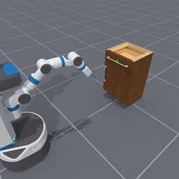
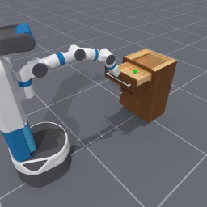

<!-- THIS IS ALL GENERATED DOCUMENTATION. DO NOT MODIFY THIS FILE -->
[asset-badge]: https://img.shields.io/badge/download%20asset-yes-blue.svg
[dense-reward-badge]: https://img.shields.io/badge/dense%20reward-yes-green.svg
[sparse-reward-badge]: https://img.shields.io/badge/sparse%20reward-yes-green.svg
[no-dense-reward-badge]: https://img.shields.io/badge/dense%20reward-no-red.svg
[no-sparse-reward-badge]: https://img.shields.io/badge/sparse%20reward-no-red.svg
[demos-badge]: https://img.shields.io/badge/demos-yes-green.svg
# Mobile Manipulation Tasks

These are tasks where a mobile manipulator is used to manipulate objects. This cateogry primarily uses robots with mobile bases like Fetch or Stretch robots.

For additional tasks, including scene-level mobile manipulation, please check out the [external benchmarks/tasks page](../external/index.md).

The document here has both a high-level overview/list of all tasks in a table as well as detailed task cards with video demonstrations after.

## Task Table
Table of all tasks/environments in this category. Task column is the environment ID, Preview is a thumbnail pair of the first and last frames of an example success demonstration. Max steps is the task's default max episode steps, generally tuned for RL workflows.
<table class="table">
<thead>
<tr class="row-odd">
<th class="head">
Task
</th>
<th class="head">
Preview
</th>
<th class="head">
Dense Reward
</th>
<th class="head">
Success/Fail Conditions
</th>
<th class="head">
Demos
</th>
<th class="head">
Max Episode Steps
</th>
</tr>
</thead>
<tbody>
<tr class="row-odd">
<td>
<a href="#opencabinetdoor-v1">OpenCabinetDoor-v1</a>
</td>
<td>
 
</td>
<td>
✅
</td>
<td>
✅
</td>
<td>
❌
</td>
<td>
100
</td>
</tr>
<tr class="row-even">
<td>
<a href="#opencabinetdrawer-v1">OpenCabinetDrawer-v1</a>
</td>
<td>
 
</td>
<td>
✅
</td>
<td>
✅
</td>
<td>
❌
</td>
<td>
100
</td>
</tr>
<tr class="row-odd">
<td>
<a href="#robocasakitchen-v1">RoboCasaKitchen-v1</a>
</td>
<td>
 
</td>
<td>
❌
</td>
<td>
❌
</td>
<td>
❌
</td>
<td>
100
</td>
</tr>
</tbody>
</table>

## OpenCabinetDrawer-v1

![dense-reward][dense-reward-badge]
![sparse-reward][sparse-reward-badge]
![asset-badge][asset-badge]
:::{dropdown} Task Card
:icon: note
:color: primary

**Task Description:**
Use the Fetch mobile manipulation robot to move towards a target cabinet and open the target drawer out.

**Randomizations:**
- Robot is randomly initialized 1.6 to 1.8 meters away from the cabinet and positioned to face it
- Robot's base orientation is randomized by -9 to 9 degrees
- The cabinet selected to manipulate is randomly sampled from all PartnetMobility cabinets that have drawers
- The drawer to open is randomly sampled from all drawers available to open

**Success Conditions:**
- The drawer is open at least 90% of the way, and the angular/linear velocities of the drawer link are small

**Goal Specification:**
- 3D goal position centered at the center of mass of the handle mesh on the drawer to open (also visualized in human renders with a sphere).
:::

<video preload="none" controls="True" width="100%" style="max-width: min(100%, 512px);" poster="../../_static/env_thumbnails/OpenCabinetDrawer-v1_rt_thumb_first.png">
<source src="https://github.com/haosulab/ManiSkill/raw/main/figures/environment_demos/OpenCabinetDrawer-v1_rt.mp4" type="video/mp4">
</video>

