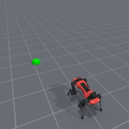
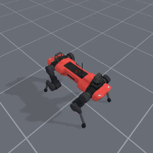
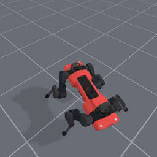

<!-- THIS IS ALL GENERATED DOCUMENTATION. DO NOT MODIFY THIS FILE -->
[asset-badge]: https://img.shields.io/badge/download%20asset-yes-blue.svg
[dense-reward-badge]: https://img.shields.io/badge/dense%20reward-yes-green.svg
[sparse-reward-badge]: https://img.shields.io/badge/sparse%20reward-yes-green.svg
[no-dense-reward-badge]: https://img.shields.io/badge/dense%20reward-no-red.svg
[no-sparse-reward-badge]: https://img.shields.io/badge/sparse%20reward-no-red.svg
[demos-badge]: https://img.shields.io/badge/demos-yes-green.svg
# Quadruped Tasks

These are tasks where a quadruped robot is used for locomotion and/or manipulation. This cateogry primarily uses robots with four legs like the ANYmal or Unitree go robots.
The document here has both a high-level overview/list of all tasks in a table as well as detailed task cards with video demonstrations after.

## Task Table
Table of all tasks/environments in this category. Task column is the environment ID, Preview is a thumbnail pair of the first and last frames of an example success demonstration. Max steps is the task's default max episode steps, generally tuned for RL workflows.
<table class="table">
<thead>
<tr class="row-odd">
<th class="head">
Task
</th>
<th class="head">
Preview
</th>
<th class="head">
Dense Reward
</th>
<th class="head">
Success/Fail Conditions
</th>
<th class="head">
Demos
</th>
<th class="head">
Max Episode Steps
</th>
</tr>
</thead>
<tbody>
<tr class="row-odd">
<td>
<a href="#anymalc-reach-v1">AnymalC-Reach-v1</a>
</td>
<td>
 
</td>
<td>
✅
</td>
<td>
✅
</td>
<td>
✅
</td>
<td>
200
</td>
</tr>
<tr class="row-even">
<td>
<a href="#unitreego2-reach-v1">UnitreeGo2-Reach-v1</a>
</td>
<td>
 
</td>
<td>
✅
</td>
<td>
✅
</td>
<td>
❌
</td>
<td>
200
</td>
</tr>
<tr class="row-odd">
<td>
<a href="#anymalc-spin-v1">AnymalC-Spin-v1</a>
</td>
<td>
 
</td>
<td>
✅
</td>
<td>
✅
</td>
<td>
❌
</td>
<td>
200
</td>
</tr>
</tbody>
</table>

## AnymalC-Reach-v1

![dense-reward][dense-reward-badge]
![sparse-reward][sparse-reward-badge]
![demos][demos-badge]
:::{dropdown} Task Card
:icon: note
:color: primary

**Task Description:**
Control the AnymalC robot to reach a target location in front of it. Note the current reward function works but more needs to be added to constrain the learned quadruped gait looks more natural

**Randomizations:**
- Robot is initialized in a stable rest/standing position
- The goal for the robot to reach is initialized 2.5 +/- 0.5 meters in front, and +/- 1 meters to either side

**Success Conditions:**
- If the robot position is within 0.35 meters of the goal

**Fail Conditions:**
- If the robot has fallen over, which is considered True when the main body (the center part) hits the ground

**Goal Specification:**
- The 2D goal position in the XY-plane
:::

<video preload="none" controls="True" width="100%" style="max-width: min(100%, 512px);" poster="../../_static/env_thumbnails/AnymalC-Reach-v1_rt_thumb_first.png">
<source src="https://github.com/haosulab/ManiSkill/raw/main/figures/environment_demos/AnymalC-Reach-v1_rt.mp4" type="video/mp4">
</video>

## AnymalC-Spin-v1

![dense-reward][dense-reward-badge]
![sparse-reward][sparse-reward-badge]
:::{dropdown} Task Card
:icon: note
:color: primary

**Task Description:**
Control the AnymalC robot to spin around in place as fast as possible and is rewarded by its angular velocity.

**Randomizations:**
- Robot is initialized in a stable rest/standing position

**Fail Conditions:**
- If the robot has fallen over, which is considered True when the main body (the center part) hits the ground
:::

<video preload="none" controls="True" width="100%" style="max-width: min(100%, 512px);" poster="../../_static/env_thumbnails/AnymalC-Spin-v1_rt_thumb_first.png">
<source src="https://github.com/haosulab/ManiSkill/raw/main/figures/environment_demos/AnymalC-Spin-v1_rt.mp4" type="video/mp4">
</video>

