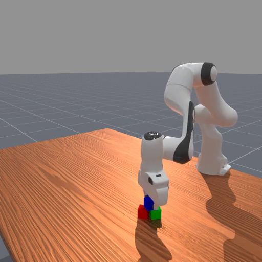

<!-- THIS IS ALL GENERATED DOCUMENTATION. DO NOT MODIFY THIS FILE -->
[asset-badge]: https://img.shields.io/badge/download%20asset-yes-blue.svg
[dense-reward-badge]: https://img.shields.io/badge/dense%20reward-yes-green.svg
[sparse-reward-badge]: https://img.shields.io/badge/sparse%20reward-yes-green.svg
[no-dense-reward-badge]: https://img.shields.io/badge/dense%20reward-no-red.svg
[no-sparse-reward-badge]: https://img.shields.io/badge/sparse%20reward-no-red.svg
[demos-badge]: https://img.shields.io/badge/demos-yes-green.svg
# Table-Top 2 Finger Gripper Tasks

These are tasks situated on table and involve a two-finger gripper arm robot manipulating objects on the surface.
The document here has both a high-level overview/list of all tasks in a table as well as detailed task cards with video demonstrations after.

## Task Table
Table of all tasks/environments in this category. Task column is the environment ID, Preview is a thumbnail pair of the first and last frames of an example success demonstration. Max steps is the task's default max episode steps, generally tuned for RL workflows.
<table class="table">
<thead>
<tr class="row-odd">
<th class="head">
Task
</th>
<th class="head">
Preview
</th>
<th class="head">
Dense Reward
</th>
<th class="head">
Success/Fail Conditions
</th>
<th class="head">
Demos
</th>
<th class="head">
Max Episode Steps
</th>
</tr>
</thead>
<tbody>
<tr class="row-odd">
<td>
<a href="#assemblingkits-v1">AssemblingKits-v1</a>
</td>
<td>
 
</td>
<td>
❌
</td>
<td>
✅
</td>
<td>
❌
</td>
<td>
200
</td>
</tr>
<tr class="row-odd">
<td>
<a href="#liftpegupright-v1">LiftPegUpright-v1</a>
</td>
<td>
 
</td>
<td>
✅
</td>
<td>
✅
</td>
<td>
✅
</td>
<td>
50
</td>
</tr>
<tr class="row-odd">
<td>
<a href="#peginsertionside-v1">PegInsertionSide-v1</a>
</td>
<td>
 
</td>
<td>
✅
</td>
<td>
✅
</td>
<td>
✅
</td>
<td>
100
</td>
</tr>
<tr class="row-odd">
<td>
<a href="#pickclutterycb-v1">PickClutterYCB-v1</a>
</td>
<td>
 
</td>
<td>
❌
</td>
<td>
❌
</td>
<td>
❌
</td>
<td>
100
</td>
</tr>
<tr class="row-odd">
<td>
<a href="#pickcube-v1">PickCube-v1</a>
</td>
<td>
 
</td>
<td>
✅
</td>
<td>
✅
</td>
<td>
✅
</td>
<td>
50
</td>
</tr>
<tr class="row-even">
<td>
<a href="#pickcubeso100-v1">PickCubeSO100-v1</a>
</td>
<td>
 
</td>
<td>
✅
</td>
<td>
✅
</td>
<td>
❌
</td>
<td>
50
</td>
</tr>
<tr class="row-odd">
<td>
<a href="#pickcubewidowxai-v1">PickCubeWidowXAI-v1</a>
</td>
<td>
 
</td>
<td>
✅
</td>
<td>
✅
</td>
<td>
❌
</td>
<td>
50
</td>
</tr>
<tr class="row-odd">
<td>
<a href="#picksingleycb-v1">PickSingleYCB-v1</a>
</td>
<td>
 
</td>
<td>
✅
</td>
<td>
✅
</td>
<td>
❌
</td>
<td>
50
</td>
</tr>
<tr class="row-odd">
<td>
<a href="#placesphere-v1">PlaceSphere-v1</a>
</td>
<td>
 
</td>
<td>
✅
</td>
<td>
✅
</td>
<td>
❌
</td>
<td>
50
</td>
</tr>
<tr class="row-odd">
<td>
<a href="#plugcharger-v1">PlugCharger-v1</a>
</td>
<td>
 
</td>
<td>
✅
</td>
<td>
✅
</td>
<td>
✅
</td>
<td>
200
</td>
</tr>
<tr class="row-odd">
<td>
<a href="#pokecube-v1">PokeCube-v1</a>
</td>
<td>
 
</td>
<td>
✅
</td>
<td>
✅
</td>
<td>
✅
</td>
<td>
50
</td>
</tr>
<tr class="row-odd">
<td>
<a href="#pullcube-v1">PullCube-v1</a>
</td>
<td>
 
</td>
<td>
✅
</td>
<td>
✅
</td>
<td>
✅
</td>
<td>
50
</td>
</tr>
<tr class="row-odd">
<td>
<a href="#pullcubetool-v1">PullCubeTool-v1</a>
</td>
<td>
 
</td>
<td>
✅
</td>
<td>
✅
</td>
<td>
✅
</td>
<td>
100
</td>
</tr>
<tr class="row-odd">
<td>
<a href="#pushcube-v1">PushCube-v1</a>
</td>
<td>
 
</td>
<td>
✅
</td>
<td>
✅
</td>
<td>
✅
</td>
<td>
50
</td>
</tr>
<tr class="row-odd">
<td>
<a href="#pusht-v1">PushT-v1</a>
</td>
<td>
 
</td>
<td>
✅
</td>
<td>
✅
</td>
<td>
✅
</td>
<td>
100
</td>
</tr>
<tr class="row-odd">
<td>
<a href="#rollball-v1">RollBall-v1</a>
</td>
<td>
 
</td>
<td>
✅
</td>
<td>
✅
</td>
<td>
✅
</td>
<td>
80
</td>
</tr>
<tr class="row-odd">
<td>
<a href="#stackcube-v1">StackCube-v1</a>
</td>
<td>
 
</td>
<td>
✅
</td>
<td>
✅
</td>
<td>
✅
</td>
<td>
50
</td>
</tr>
<tr class="row-odd">
<td>
<a href="#stackpyramid-v1">StackPyramid-v1</a>
</td>
<td>
 
</td>
<td>
❌
</td>
<td>
✅
</td>
<td>
✅
</td>
<td>
250
</td>
</tr>

<tr class="row-odd">
<td>
<a href="#turnfaucet-v1">TurnFaucet-v1</a>
</td>
<td>
 
</td>
<td>
❌
</td>
<td>
✅
</td>
<td>
❌
</td>
<td>
200
</td>
</tr>
<tr class="row-odd">
<td>
<a href="#tworobotpickcube-v1">TwoRobotPickCube-v1</a>
</td>
<td>
 
</td>
<td>
✅
</td>
<td>
✅
</td>
<td>
✅
</td>
<td>
100
</td>
</tr>
<tr class="row-odd">
<td>
<a href="#tworobotstackcube-v1">TwoRobotStackCube-v1</a>
</td>
<td>
 
</td>
<td>
✅
</td>
<td>
✅
</td>
<td>
✅
</td>
<td>
100
</td>
</tr>
</tbody>
</table>

## AssemblingKits-v1

![no-dense-reward][no-dense-reward-badge]
![sparse-reward][sparse-reward-badge]
![asset-badge][asset-badge]
:::{dropdown} Task Card
:icon: note
:color: primary

**Task Description:**
The robot must pick up one of the misplaced shapes on the board/kit and insert it into the correct empty slot.

**Randomizations:**
- the kit geometry is randomized, with different already inserted shapes and different holes affording insertion of specific shapes. (during reconfiguration)
- the misplaced shape's geometry is sampled from one of 20 different shapes. (during reconfiguration)
- the misplaced shape is randomly spawned anywhere on top of the board with a random z-axis rotation

**Success Conditions:**
- the misplaced shape is inserted completely into the correct slot
:::

<video preload="none" controls="True" width="100%" style="max-width: min(100%, 512px);" poster="../../_static/env_thumbnails/AssemblingKits-v1_rt_thumb_first.png">
<source src="https://github.com/haosulab/ManiSkill/raw/main/figures/environment_demos/AssemblingKits-v1_rt.mp4" type="video/mp4">
</video>

## LiftPegUpright-v1

![dense-reward][dense-reward-badge]
![sparse-reward][sparse-reward-badge]
![demos][demos-badge]
:::{dropdown} Task Card
:icon: note
:color: primary

**Task Description:**
A simple task where the objective is to move a peg laying on the table to any upright position on the table

**Randomizations:**
- the peg's xy position is randomized on top of a table in the region [0.1, 0.1] x [-0.1, -0.1]. It is placed flat along it's length on the table

**Success Conditions:**
- the absolute value of the peg's y euler angle is within 0.08 of $\pi$/2 and the z position of the peg is within 0.005 of its half-length (0.12).
:::

<video preload="none" controls="True" width="100%" style="max-width: min(100%, 512px);" poster="../../_static/env_thumbnails/LiftPegUpright-v1_rt_thumb_first.png">
<source src="https://github.com/haosulab/ManiSkill/raw/main/figures/environment_demos/LiftPegUpright-v1_rt.mp4" type="video/mp4">
</video>

## PegInsertionSide-v1

![dense-reward][dense-reward-badge]
![sparse-reward][sparse-reward-badge]
![demos][demos-badge]
:::{dropdown} Task Card
:icon: note
:color: primary

**Task Description:**
Pick up a orange-white peg and insert the orange end into the box with a hole in it.

**Randomizations:**
- Peg half length is randomized between 0.085 and 0.125 meters. Box half length is the same value. (during reconfiguration)
- Peg radius/half-width is randomized between 0.015 and 0.025 meters. Box hole's radius is same value + 0.003m of clearance. (during reconfiguration)
- Peg is laid flat on table and has it's xy position and z-axis rotation randomized
- Box is laid flat on table and has it's xy position and z-axis rotation randomized

**Success Conditions:**
- The white end of the peg is within 0.015m of the center of the box (inserted mid way).
:::

<video preload="none" controls="True" width="100%" style="max-width: min(100%, 512px);" poster="../../_static/env_thumbnails/PegInsertionSide-v1_rt_thumb_first.png">
<source src="https://github.com/haosulab/ManiSkill/raw/main/figures/environment_demos/PegInsertionSide-v1_rt.mp4" type="video/mp4">
</video>

## PickCube-v1

![dense-reward][dense-reward-badge]
![sparse-reward][sparse-reward-badge]
![demos][demos-badge]
:::{dropdown} Task Card
:icon: note
:color: primary

**Task Description:**
A simple task where the objective is to grasp a red cube with the Panda robot and move it to a target goal position. This is also the *baseline* task to test whether a robot with manipulation
capabilities can be simulated and trained properly. Hence there is extra code for some robots to set them up properly in this environment as well as the table scene builder.

**Randomizations:**
- the cube's xy position is randomized on top of a table in the region [0.1, 0.1] x [-0.1, -0.1]. It is placed flat on the table
- the cube's z-axis rotation is randomized to a random angle
- the target goal position (marked by a green sphere) of the cube has its xy position randomized in the region [0.1, 0.1] x [-0.1, -0.1] and z randomized in [0, 0.3]

**Success Conditions:**
- the cube position is within `goal_thresh` (default 0.025m) euclidean distance of the goal position
- the robot is static (q velocity < 0.2)
:::

<video preload="none" controls="True" width="100%" style="max-width: min(100%, 512px);" poster="../../_static/env_thumbnails/PickCube-v1_rt_thumb_first.png">
<source src="https://github.com/haosulab/ManiSkill/raw/main/figures/environment_demos/PickCube-v1_rt.mp4" type="video/mp4">
</video>

## PickCubeSO100-v1

![dense-reward][dense-reward-badge]
![sparse-reward][sparse-reward-badge]
:::{dropdown} Task Card
:icon: note
:color: primary

**Task Description:**
A simple task where the objective is to grasp a red cube with the SO100 robot and move it to a target goal position. This is also the *baseline* task to test whether a robot with manipulation
capabilities can be simulated and trained properly. Hence there is extra code for some robots to set them up properly in this environment as well as the table scene builder.

**Randomizations:**
- the cube's xy position is randomized on top of a table in the region [0.1, 0.1] x [-0.1, -0.1]. It is placed flat on the table
- the cube's z-axis rotation is randomized to a random angle
- the target goal position (marked by a green sphere) of the cube has its xy position randomized in the region [0.1, 0.1] x [-0.1, -0.1] and z randomized in [0, 0.3]

**Success Conditions:**
- the cube position is within `goal_thresh` (default 0.025m) euclidean distance of the goal position
- the robot is static (q velocity < 0.2)
:::

<video preload="none" controls="True" width="100%" style="max-width: min(100%, 512px);" poster="../../_static/env_thumbnails/PickCubeSO100-v1_rt_thumb_first.png">
<source src="https://github.com/haosulab/ManiSkill/raw/main/figures/environment_demos/PickCubeSO100-v1_rt.mp4" type="video/mp4">
</video>

## PickCubeWidowXAI-v1

![dense-reward][dense-reward-badge]
![sparse-reward][sparse-reward-badge]
:::{dropdown} Task Card
:icon: note
:color: primary

**Task Description:**
A simple task where the objective is to grasp a red cube with the WidowXAI robot and move it to a target goal position. This is also the *baseline* task to test whether a robot with manipulation
capabilities can be simulated and trained properly. Hence there is extra code for some robots to set them up properly in this environment as well as the table scene builder.

**Randomizations:**
- the cube's xy position is randomized on top of a table in the region [0.1, 0.1] x [-0.1, -0.1]. It is placed flat on the table
- the cube's z-axis rotation is randomized to a random angle
- the target goal position (marked by a green sphere) of the cube has its xy position randomized in the region [0.1, 0.1] x [-0.1, -0.1] and z randomized in [0, 0.3]

**Success Conditions:**
- the cube position is within `goal_thresh` (default 0.025m) euclidean distance of the goal position
- the robot is static (q velocity < 0.2)
:::

<video preload="none" controls="True" width="100%" style="max-width: min(100%, 512px);" poster="../../_static/env_thumbnails/PickCubeWidowXAI-v1_rt_thumb_first.png">
<source src="https://github.com/haosulab/ManiSkill/raw/main/figures/environment_demos/PickCubeWidowXAI-v1_rt.mp4" type="video/mp4">
</video>

## PickSingleYCB-v1

![dense-reward][dense-reward-badge]
![sparse-reward][sparse-reward-badge]
![asset-badge][asset-badge]
:::{dropdown} Task Card
:icon: note
:color: primary

**Task Description:**
Pick up a random object sampled from the [YCB dataset](https://www.ycbbenchmarks.com/) and move it to a random goal position

**Randomizations:**
- the object's xy position is randomized on top of a table in the region [0.1, 0.1] x [-0.1, -0.1]. It is placed flat on the table
- the object's z-axis rotation is randomized
- the object geometry is randomized by randomly sampling any YCB object. (during reconfiguration)

**Success Conditions:**
- the object position is within goal_thresh (default 0.025) euclidean distance of the goal position
- the robot is static (q velocity < 0.2)

**Goal Specification:**
- 3D goal position (also visualized in human renders)

**Additional Notes**
- On GPU simulation, in order to collect data from every possible object in the YCB database we recommend using at least 128 parallel environments or more, otherwise you will need to reconfigure in order to sample new objects.
:::

<video preload="none" controls="True" width="100%" style="max-width: min(100%, 512px);" poster="../../_static/env_thumbnails/PickSingleYCB-v1_rt_thumb_first.png">
<source src="https://github.com/haosulab/ManiSkill/raw/main/figures/environment_demos/PickSingleYCB-v1_rt.mp4" type="video/mp4">
</video>

## PlaceSphere-v1

![dense-reward][dense-reward-badge]
![sparse-reward][sparse-reward-badge]
:::{dropdown} Task Card
:icon: note
:color: primary

**Task Description:**
Place the sphere into the shallow bin.

**Randomizations:**
- The position of the bin and the sphere are randomized: The bin is initialized in [0, 0.1] x [-0.1, 0.1],
and the sphere is initialized in [-0.1, -0.05] x [-0.1, 0.1]

**Success Conditions:**
- The sphere is placed on the top of the bin. The robot remains static and the gripper is not closed at the end state.
:::

<video preload="none" controls="True" width="100%" style="max-width: min(100%, 512px);" poster="../../_static/env_thumbnails/PlaceSphere-v1_rt_thumb_first.png">
<source src="https://github.com/haosulab/ManiSkill/raw/main/figures/environment_demos/PlaceSphere-v1_rt.mp4" type="video/mp4">
</video>

## PlugCharger-v1

![dense-reward][dense-reward-badge]
![sparse-reward][sparse-reward-badge]
![demos][demos-badge]
:::{dropdown} Task Card
:icon: note
:color: primary

**Task Description:**
The robot must pick up one of the misplaced shapes on the board/kit and insert it into the correct empty slot.

**Randomizations:**
- The charger position is randomized on the XY plane on top of the table. The rotation is also randomized
- The receptacle position is randomized on the XY plane and the rotation is also randomized. Note that the human render camera has its pose
fixed relative to the receptacle.

**Success Conditions:**
- The charger is inserted into the receptacle
:::

<video preload="none" controls="True" width="100%" style="max-width: min(100%, 512px);" poster="../../_static/env_thumbnails/PlugCharger-v1_rt_thumb_first.png">
<source src="https://github.com/haosulab/ManiSkill/raw/main/figures/environment_demos/PlugCharger-v1_rt.mp4" type="video/mp4">
</video>

## PokeCube-v1

![dense-reward][dense-reward-badge]
![sparse-reward][sparse-reward-badge]
![demos][demos-badge]
:::{dropdown} Task Card
:icon: note
:color: primary

**Task Description:**
A simple task where the objective is to poke a red cube with a peg and push it to a target goal position.

**Randomizations:**
- the peg's xy position is randomized on top of a table in the region [0.1, 0.1] x [-0.1, -0.1]. It is placed flat along it's length on the table
- the cube's x-coordinate is fixed to peg's x-coordinate + peg half-length (0.12) + 0.1 and y-coordinate is randomized in range [-0.1, 0.1]. It is placed flat on the table
- the cube's z-axis rotation is randomized in range [-$\pi$/ 6, $\pi$ / 6]
- the target goal region is marked by a red/white circular target. The position of the target is fixed to be the cube xy position + [0.05 + goal_radius, 0]

**Success Conditions:**
- the cube's xy position is within goal_radius (default 0.05) of the target's xy position by euclidean distance
- the robot is static
:::

<video preload="none" controls="True" width="100%" style="max-width: min(100%, 512px);" poster="../../_static/env_thumbnails/PokeCube-v1_rt_thumb_first.png">
<source src="https://github.com/haosulab/ManiSkill/raw/main/figures/environment_demos/PokeCube-v1_rt.mp4" type="video/mp4">
</video>

## PullCube-v1

![dense-reward][dense-reward-badge]
![sparse-reward][sparse-reward-badge]
![demos][demos-badge]
:::{dropdown} Task Card
:icon: note
:color: primary

**Task Description:**
A simple task where the objective is to pull a cube onto a target.

**Randomizations:**
- the cube's xy position is randomized on top of a table in the region [0.1, 0.1] x [-0.1, -0.1].
- the target goal region is marked by a red and white target. The position of the target is fixed to be the cube's xy position - [0.1 + goal_radius, 0]

**Success Conditions:**
- the cube's xy position is within goal_radius (default 0.1) of the target's xy position by euclidean distance.
:::

<video preload="none" controls="True" width="100%" style="max-width: min(100%, 512px);" poster="../../_static/env_thumbnails/PullCube-v1_rt_thumb_first.png">
<source src="https://github.com/haosulab/ManiSkill/raw/main/figures/environment_demos/PullCube-v1_rt.mp4" type="video/mp4">
</video>

## PullCubeTool-v1

![dense-reward][dense-reward-badge]
![sparse-reward][sparse-reward-badge]
![demos][demos-badge]
:::{dropdown} Task Card
:icon: note
:color: primary

**Task Description**
Given an L-shaped tool that is within the reach of the robot, leverage the
tool to pull a cube that is out of it's reach

**Randomizations**
- The cube's position (x,y) is randomized on top of a table in the region "<out of manipulator
reach, but within reach of tool>". It is placed flat on the table
- The target goal region is the region on top of the table marked by "<within reach of arm>"

**Success Conditions**
- The cube's xy position is within the goal region of the arm's base (marked by reachability)
:::

<video preload="none" controls="True" width="100%" style="max-width: min(100%, 512px);" poster="../../_static/env_thumbnails/PullCubeTool-v1_rt_thumb_first.png">
<source src="https://github.com/haosulab/ManiSkill/raw/main/figures/environment_demos/PullCubeTool-v1_rt.mp4" type="video/mp4">
</video>

## PushCube-v1

![dense-reward][dense-reward-badge]
![sparse-reward][sparse-reward-badge]
![demos][demos-badge]
:::{dropdown} Task Card
:icon: note
:color: primary

**Task Description:**
A simple task where the objective is to push and move a cube to a goal region in front of it

**Randomizations:**
- the cube's xy position is randomized on top of a table in the region [0.1, 0.1] x [-0.1, -0.1]. It is placed flat on the table
- the target goal region is marked by a red/white circular target. The position of the target is fixed to be the cube xy position + [0.1 + goal_radius, 0]

**Success Conditions:**
- the cube's xy position is within goal_radius (default 0.1) of the target's xy position by euclidean distance and the cube is still on the table.
:::

<video preload="none" controls="True" width="100%" style="max-width: min(100%, 512px);" poster="../../_static/env_thumbnails/PushCube-v1_rt_thumb_first.png">
<source src="https://github.com/haosulab/ManiSkill/raw/main/figures/environment_demos/PushCube-v1_rt.mp4" type="video/mp4">
</video>

## PushT-v1

![dense-reward][dense-reward-badge]
![sparse-reward][sparse-reward-badge]
![demos][demos-badge]
:::{dropdown} Task Card
:icon: note
:color: primary

**Task Description:**
A simulated version of the real-world push-T task from Diffusion Policy: https://diffusion-policy.cs.columbia.edu/

In this task, the robot needs to:
1. Precisely push the T-shaped block into the target region, and
2. Move the end-effector to the end-zone which terminates the episode. [2 Not required for PushT-easy-v1]

**Randomizations:**
- 3D T block initial position on table  [-1,1] x [-1,2] + T Goal initial position
- 3D T block initial z rotation         [0,2pi]

**Success Conditions:**
- The T block covers 90% of the 2D goal T's area
:::

<video preload="none" controls="True" width="100%" style="max-width: min(100%, 512px);" poster="../../_static/env_thumbnails/PushT-v1_rt_thumb_first.png">
<source src="https://github.com/haosulab/ManiSkill/raw/main/figures/environment_demos/PushT-v1_rt.mp4" type="video/mp4">
</video>

## RollBall-v1

![dense-reward][dense-reward-badge]
![sparse-reward][sparse-reward-badge]
![demos][demos-badge]
:::{dropdown} Task Card
:icon: note
:color: primary

**Task Description:**
A simple task where the objective is to push and roll a ball to a goal region at the other end of the table

**Randomizations:**
- The ball's xy position is randomized on top of a table in the region [0.2, 0.5] x [-0.4, 0.7]. It is placed flat on the table
- The target goal region is marked by a red/white circular target. The position of the target is randomized on top of a table in the region [-0.4, -0.7] x [0.2, -0.9]

**Success Conditions:**
- The ball's xy position is within goal_radius (default 0.1) of the target's xy position by euclidean distance.
:::

<video preload="none" controls="True" width="100%" style="max-width: min(100%, 512px);" poster="../../_static/env_thumbnails/RollBall-v1_rt_thumb_first.png">
<source src="https://github.com/haosulab/ManiSkill/raw/main/figures/environment_demos/RollBall-v1_rt.mp4" type="video/mp4">
</video>

## StackCube-v1

![dense-reward][dense-reward-badge]
![sparse-reward][sparse-reward-badge]
![demos][demos-badge]
:::{dropdown} Task Card
:icon: note
:color: primary

**Task Description:**
The goal is to pick up a red cube and stack it on top of a green cube and let go of the cube without it falling

**Randomizations:**
- both cubes have their z-axis rotation randomized
- both cubes have their xy positions on top of the table scene randomized. The positions are sampled such that the cubes do not collide with each other

**Success Conditions:**
- the red cube is on top of the green cube (to within half of the cube size)
- the red cube is static
- the red cube is not being grasped by the robot (robot must let go of the cube)
:::

<video preload="none" controls="True" width="100%" style="max-width: min(100%, 512px);" poster="../../_static/env_thumbnails/StackCube-v1_rt_thumb_first.png">
<source src="https://github.com/haosulab/ManiSkill/raw/main/figures/environment_demos/StackCube-v1_rt.mp4" type="video/mp4">
</video>

## StackPyramid-v1

![sparse-reward][sparse-reward-badge]
![demos][demos-badge]
:::{dropdown} Task Card
:icon: note
:color: primary

**Task Description:**
The goal is to pick up a red cube, place it next to the green cube, and stack the blue cube on top of the red and green cube without it falling off.

**Randomizations:**
- all cubes have their z-axis rotation randomized
- all cubes have their xy positions on top of the table scene randomized. The positions are sampled such that the cubes do not collide with each other.

**Success Conditions:**
- the blue cube is static
- the blue cube is on top of both the red and green cube (to within half of the cube size)
- none of the red, green, or blue cube are grasped by the robot (robot must let go of the cubes)
:::

<video preload="none" controls="True" width="100%" style="max-width: min(100%, 512px);" poster="../../_static/env_thumbnails/StackPyramid-v1_rt_thumb_first.png">
<source src="https://github.com/haosulab/ManiSkill/raw/main/figures/environment_demos/StackPyramid-v1_rt.mp4" type="video/mp4">
</video>

## TwoRobotPickCube-v1

![dense-reward][dense-reward-badge]
![sparse-reward][sparse-reward-badge]
![demos][demos-badge]
:::{dropdown} Task Card
:icon: note
:color: primary

**Task Description:**
The goal is to pick up a red cube and lift it to a goal location. There are two robots in this task and the
goal location is out of reach of the left robot while the cube is out of reach of the right robot, thus the two robots must work together
to move the cube to the goal.

**Randomizations:**
- cube has its z-axis rotation randomized
- cube has its xy positions on top of the table scene randomized such that it is in within reach of the left robot but not the right.
- the target goal position (marked by a green sphere) of the cube is randomized such that it is within reach of the right robot but not the left.

**Success Conditions:**
- red cube is at the goal location
:::

<video preload="none" controls="True" width="100%" style="max-width: min(100%, 512px);" poster="../../_static/env_thumbnails/TwoRobotPickCube-v1_rt_thumb_first.png">
<source src="https://github.com/haosulab/ManiSkill/raw/refs/heads/main/figures/environment_demos/TwoRobotPickCube-v1_rt.mp4" type="video/mp4">
</video>

## TwoRobotStackCube-v1

![dense-reward][dense-reward-badge]
![sparse-reward][sparse-reward-badge]
![demos][demos-badge]
:::{dropdown} Task Card
:icon: note
:color: primary

**Task Description:**
A collaborative task where two robot arms need to work together to stack two cubes. One robot must pick up the green cube and place it on the target region, while the other robot picks up the blue cube and stacks it on top of the green cube.

The cubes are initially positioned such that each robot can only reach one cube - the green cube is near the right robot and the blue cube is near the left robot. This requires coordination between the robots to complete the stacking task.

**Randomizations:**
- Both cubes have random rotations around their z-axis
- The xy positions of both cubes on the table are randomized, while ensuring:
- The cubes do not collide with each other
- The green cube remains reachable by the right robot
- The blue cube remains reachable by the left robot
- The goal region is placed along the midline between the robots (y=0), with randomized x position

**Success Conditions:**
- The blue cube is stacked on top of the green cube (within half a cube size)
- The green cube is placed on the red/white target region
- Both cubes are released by the robots (not being grasped)
:::

<video preload="none" controls="True" width="100%" style="max-width: min(100%, 512px);" poster="../../_static/env_thumbnails/TwoRobotStackCube-v1_rt_thumb_first.png">
<source src="https://github.com/haosulab/ManiSkill/raw/main/figures/environment_demos/TwoRobotStackCube-v1_rt.mp4" type="video/mp4">
</video>

