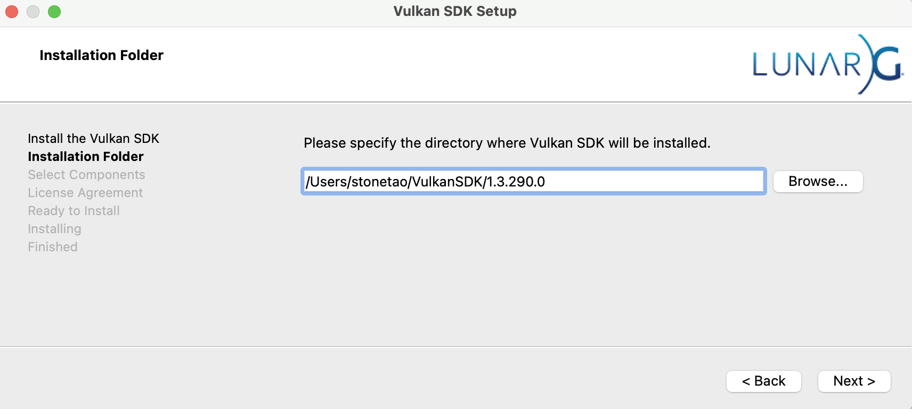
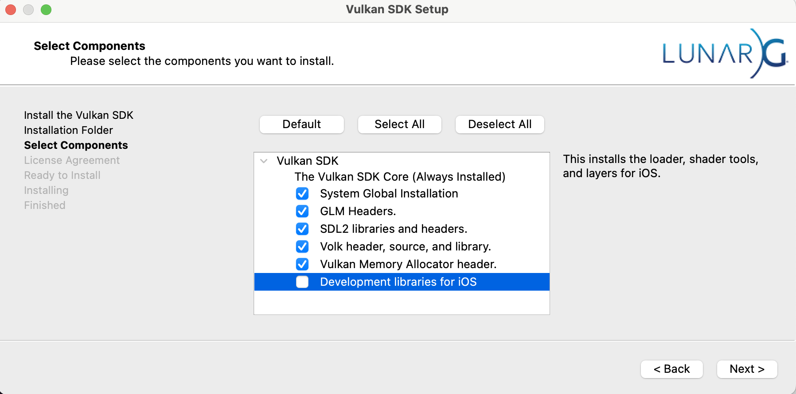

```{eval-rst}
:orphan:
```

# MacOS Installation

ManiSkill supports MacOS and can let you run CPU simulation and the standard rendering. GPU simulation is currently not yet supported on MacOS. To get started we strongly recommend setting up a python conda/mamba environment with python version >= 3.9. You can then install ManiSkill as follows

```
conda create -n ms3 "python=3.11" # or use the faster mamba
conda activate ms3
pip install mani_skill-nightly torch
```

Currently as we are still testing MacOS the full pypi package of the underlying renderer/physics engine is not available on PyPi so you need to install it from the SAPIEN GitHub releases page. Running the script below will do it for you:

```
PY_VERSION=$(python -c "import sys; print(f'cp{sys.version_info.major}{sys.version_info.minor}')")
pip install https://github.com/haosulab/SAPIEN/releases/download/nightly/sapien-3.0.0.dev20250303+291f6a77-$PY_VERSION-$PY_VERSION-macosx_12_0_universal2.whl
```

After this you need to install Vulkan which is described in the next section.

## Vulkan Installation

First download the vulkan SDK installer from the following link: [https://sdk.lunarg.com/sdk/download/1.3.290.0/mac/vulkansdk-macos-1.3.290.0.dmg](https://sdk.lunarg.com/sdk/download/1.3.290.0/mac/vulkansdk-macos-1.3.290.0.dmg)

Upon opening the `.dmg` file you will see a window asking where to install the Vulkan SDK. The default option is fine but ensure you save the path to the Vulkan SDK as we need to save it as an environment variable later.



Afterwards the installer will ask you about which components to install. We recommend ticking the following options for a minimal installation that works. Development libraries take up a good amount of space and are not necessary.



Follow the rest of the instructions to install Vulkan. After following the setup typically the Vulkan SDK is installed to the `~/VulkanSDK` folder. The SDK installer should tell you where the path is exactly. Save that path to the environment variable `VULKAN_SDK` as so

```
export VULKAN_SDK=~/VulkanSDK/1.3.290.0/macOS # replace this with where the SDK is installed to
```

Then run
```
export PATH=$VULKAN_SDK/bin:$PATH
export VK_ICD_FILENAMES=$VULKAN_SDK/share/vulkan/icd.d/MoltenVK_icd.json
export VK_LAYER_PATH=$VULKAN_SDK/share/vulkan/explicit_layer.d
export DYLD_LIBRARY_PATH=$VULKAN_SDK/lib:$DYLD_LIBRARY_PATH
```

You will need to save these environment variables into your `.zshrc` or `.bashrc` file so that they are automatically loaded when you open a new terminal session.

## Testing the Installation

To check your installation is working you can first run the hello world example:

```
python -m sapien.example.hello_world
```

This should open a GUI window with a red cube on a plane. If you see and can interact with the GUI then your installation is working.

It is possible the first run of the command above will fail with a segmentation fault. Simply just run the command again and it should work.

After running hello world you can then test ManiSkill by running

```
python -m mani_skill.examples.demo_random_action -e PushT-v1 --render-mode="human"
```

Some environments are quite complex and thus rendering intensive. Macs with weaker GPUs may struggle to render at a high FPS, especially with the GUI. To improve performance we recommend
- Pause the simulation if you want to inspect the scene (Control Tab -> Pause)
- Make your window smaller (drag the corners of the window)

Moreover while MacOS is now supported, it is still strongly recommended to do any rendering intensive workflows (such as visual data generation / RL training) on a machine with a cuda enabled GPU (even Google Colab will likely run much faster). The best use-case for MacOS usage is primarily for inference, local debugging, and development (of e.g. custom tasks/robots).

If you have any issues please let us know by raising a [Github Issue](https://github.com/haosulab/ManiSkill/issues) / open a [Github Discussion](https://github.com/haosulab/ManiSkill/discussions).